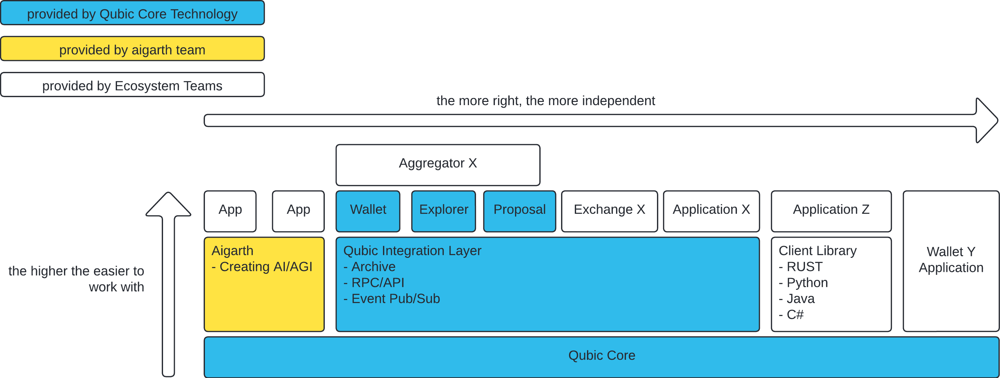
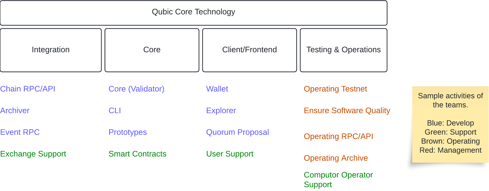

# About Qubic Core Technology

**Content**
- [About Qubic Core Technology](#about-qubic-core-technology)
  - [The History](#the-history)
  - [Architecture Overview](#architecture-overview)
  - [General Organization](#general-organization)
  - [Provided Services](#provided-services)
  - [Maintained Products/Software](#maintained-productssoftware)
  - [Open Source](#open-source)

## The History
During the first STECO period (oct23-apr24) QCT was operated as a tech department which is able to deliver the Qubic core technology including the needed tools to work with Qubic.
This includes the Qubic core (https://github.com/Qubic/core) but also tools around needed to grow Qubic (CLI, wallet, explorer, archive, RPC/API and some libraries). The tech team was also heavily involved in integrations for exchanges or wallets.

This organisation was to bootsrap all the needed tech to the users. While all those software was needed to ramp up Qubic and to enable the community to interact with Qubic easily. It was a classical organization how one would know it from companies.

To promote the spirit of decentralization the existing centralized STECO organization was disolved and at that place Workgroups were established.

One of those workgroups is `Qubic Core Technology` (QCT). This document shall describe what QCT is about.

## Architecture Overview

The architecture overview give a high level insight on the Qubic layers and what for QCT is responsible.

## General Organization
An organizational structure is something dynamic. Below you find the high level strucutre how we are organized. The latest details/state is documented in [the org reports](../org-reports/README.md).

## Provided Services

QCT is working on various products and services:

- Develops and maintains the Qubic Core and Qubic Network protocol
- Supports developpers of smart contracts, including partial code reviews and specific support for projects
- Builds and operates the Qubic Integration Layer, enabling wallets, exchanges, and other applications to access the Qubic network
- Operates and maintains the Qubic Testnet
- Drives versioning and release management for the Qubic Core and Integration Layer
- Maintains all software developed by Qubic Core Technology
- Produces clear documentation explaining how the software works, how to use it, and the logic behind it—both in code comments and external guides
- Provides technical support to other ecosystem builders building on top of Qubic
- Develops and maintains the basic Explorer frontend (explorer.qubic.org)
- Develops and maintains the basic Wallets (wallet.qubic.org, Android, iOs)
- Maintains the proposal frontend (proposals.qubic.org)
  
## Maintained Products/Software

Below some of our main products:

- Qubic RPC/API Infrastructure
- Qubic General Tech Support
- Qubic Smart Contract integration support
- Qubic Core Node (https://github.com/qubic/core)
- Qubic Core Lite Node
- Qubic CLI (https://github.com/qubic/qubic-cli)
- Qubic Archiver (https://github.com/qubic/go-archiver)
- Qubic Events (https://github.com/qubic/go-events)
- Qubic TS Library (https://github.com/qubic/ts-library)
- Explorer frontend
- Wallet frontends
- Quorum Proposal frontend
- And many other tools around Qubic Core

## Open Source
All Software developed, used and maintained by QCS is open source.

The Github entrypoint is https://github.com/qubic.