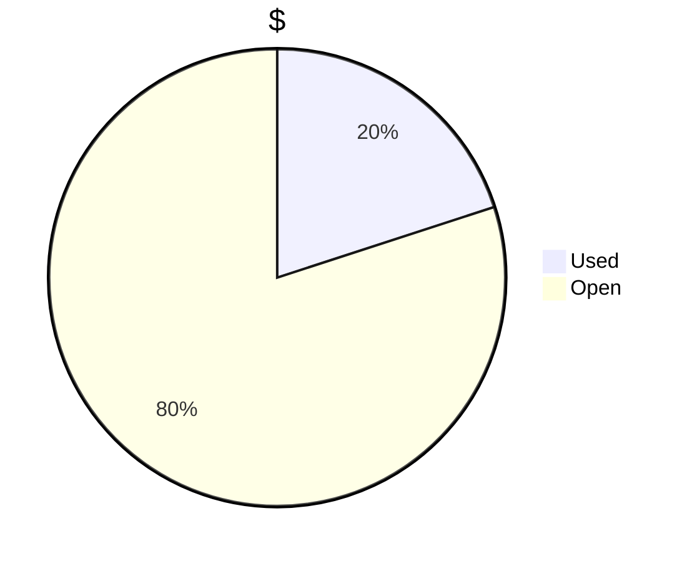
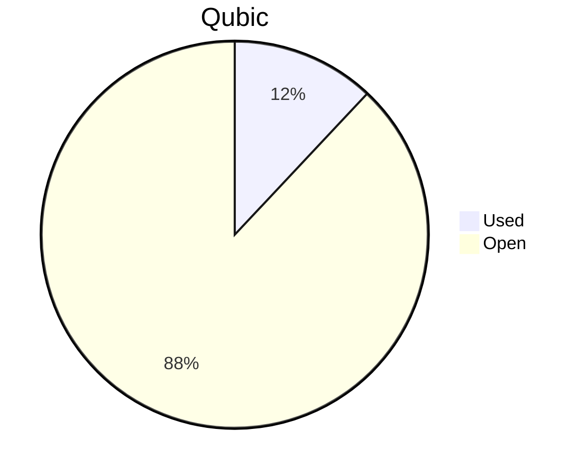

# Financial Reporting November 2024
For november 2024 QCT has spent a total of `22'080'817'170 Qubic`.
`15'810'743'920 Qubic` have been valued at `2150/bln` and `6'270'073'250 Qubic` have been valued at `4000/bln`.

> Total spent in November: **59'073.39 $** (until 13.12.2024)

## Cost Breakdown

<div style="display: flex; justify-content: center; align-items: center; gap: 10px;flex-wrap:wrap;">
<div>

 ```mermaid
pie title Categories
"Salaries":97.6845870130595
"Infrastructure":2.31541298694054
```

</div>
 <div>

 ```mermaid
pie showData title Teams
"Core":79
"Integration":17
"Testing":4
"Operation":0
"Overhead":0
```

 </div>
</div>


## Budget View
> Total available budget for Nov24-Jan25: `300'000 $` or `180'000'000'000 Qubic`.

<div style="display: flex; justify-content: center; align-items: center; gap: 10px;flex-wrap:wrap;">
<div>




</div>
 <div>



 </div>
</div>

## Included Salaries
Because not all developers receive a fixed salary and they send reports on their worked hours. The monthly budget can fluctuate. The above numbers include the salaries for november of the following persons:

`icyblob, linckode, fnordspace, raika sternensucher, cyber-pc, kavatak, mio, phil`

it doesn't include this persons: `dkat, luk`

## Delayed Transactions
Because we were not ready with the org and auditing, the november payments were already done upfront.

Transacions made **upfront**:

| Date   |      $ Amount      |  $-bQubic | Qubic Amount | Reason |
|----------|-------------:|------:| ---:| --- |
| 25.11.2024 | 31'463.10$ |   2150$ | 14'633'999'733 Qubic | Salaries |
| 26.11.2024 |   2'530.00$   |   2150$ |  1’176’744’187 Qubic | Salaries |
| 02.12.2024 | 23'712.50$ |    4000$ |  5'928'125'000 Qubic | Salaries |
| 02.12.2024 | 1367.79$ |    4000$ | 341'948'250 Qubic | Server |

**Effective** payments from trasury account:

| Date   |      $ Amount      |  $-bQubic | Qubic Amount | Reason |
|----------|-------------:|------:| ---:| --- |
| 13.12.2024 | 59'073.39$ |   ~2675.33$ | 22,080,817,170 Qubic | Salaries and Server |

### Current Balance
> Initial Balance: `180'000'000'000 Qubic`

> Balance after payments: `157'919'182'830 Qubic`

https://explorer.qubic.org/network/address/XQCLNHCEHTKQZDBAHJFVVTRMWFACMAZOBAEDQHEITGGEWZDIBRAIYWPGEONG