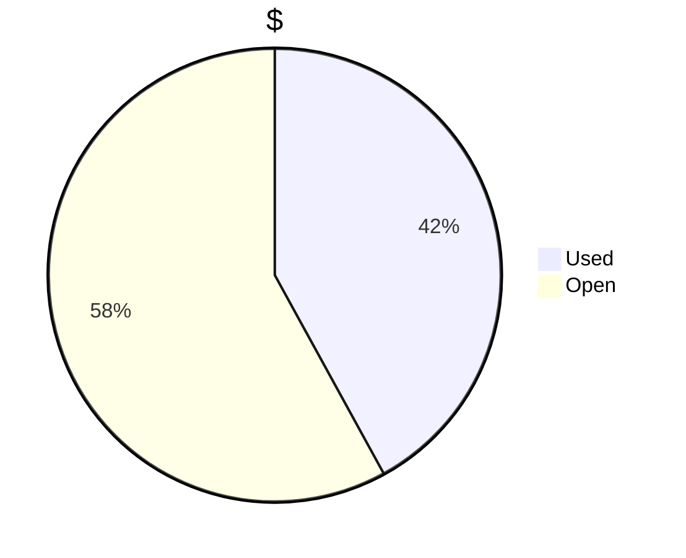
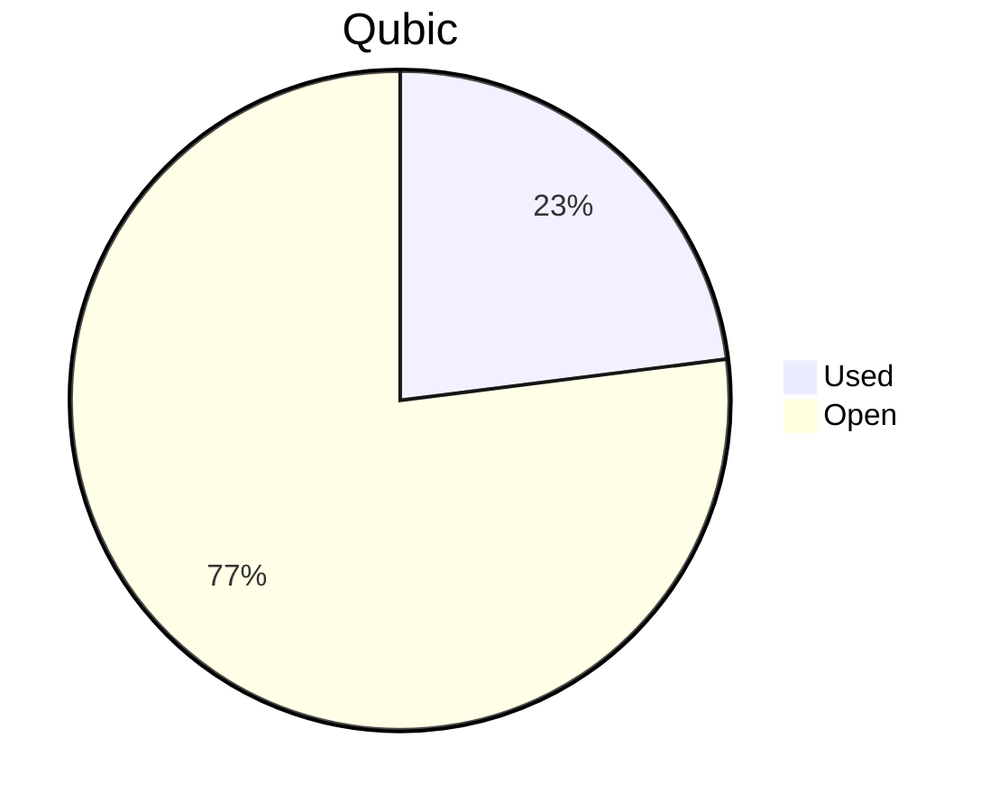

# Financial Reporting December 2024
For december 2024 QCT has spent a total of `20’069’388’400 Qubic`.
` 14’691’670’535 Qubic` have been valued at `3550/bln`, `2'991'083'020 Qubic` have been valued at `2927/bln` and `2'386'634'845 Qubic` have been valued at `2933/bln`.

The different exchange rates are because we do not receive all invoices at the same date.

> Total spent in November: **67’910.33 $** (until 05.01.2025)

## Cost Breakdown

<div style="display: flex; justify-content: center; align-items: center; gap: 10px;flex-wrap:wrap;">
<div>

 ```mermaid
pie title Categories
"Salaries":98.0050658095458
"Infrastructure":1.99493419045418

```

</div>
 <div>

 ```mermaid
pie title Categories
"Core":46.7313566704055
"Integration":30.0361637392916
"Testing":7.67829364418395
"Operation":0
"Overhead":13.3171334217159

```

 </div>
</div>

## Budget View
> Total available budget for Nov24-Jan25: `300'000 $` or `180'000'000'000 Qubic`.

<div style="display: flex; justify-content: center; align-items: center; gap: 10px;flex-wrap:wrap;">
<div>




</div>
 <div>



 </div>
</div>

>[!NOTE] 
>The current Qubic price will allow QCT to operate longer than expected! :)

## Included Salaries
Because not all developers receive a fixed salary and they send reports on their worked hours. The monthly budget can fluctuate. The above numbers include the salaries for november of the following persons:

```
linckode
luk
icyblob
raika sternensucher
fnordspace
cyber-pc
kavatak
yurabb8
wfschrec
mio
AndyQus
phil
```
it doesn't include this persons: `dkat`

> [!NOTE]
> Because a november invoice came late. It was paid within the december budget.

## Transactions


| PayDate    | TargetMonth | Wallet | Category | EUR               | EUR-$         | CHF                  | CHF-$         | $-Qubic/b       | Amount $       | Amount Qubic         | TX Link                                                                                            |
| ---------- | ----------- | ------ | -------- | ----------------- | ------------- | -------------------- | ------------- | --------------- | -------------- | -------------------- | -------------------------------------------------------------------------------------------------- |
| 21.12.2024 | December | QCT-Integration    | Salary |  €              - |  €          - |  €                 - |  €          - |  €     3’550.00 |  €    3’000.00   |  €      845’070’422.54  | https://explorer.qubic.org/network/tx/iejlwkllzlxxbhmzunuaoiesdcrdnfjcctphnmvngdqvikdpvjobxvxdbfon |
| 21.12.2024 | November | QCT-Integration    | Salary |  €              - |  €          - |  €                 - |  €          - |  €     3’550.00 |  €    7’350.00   |  €  2’070’422’535.21    | https://explorer.qubic.org/network/tx/iejlwkllzlxxbhmzunuaoiesdcrdnfjcctphnmvngdqvikdpvjobxvxdbfon |
| 21.12.2024 | December | QCT-Core           | Salary |  €              - |  €          - |  €                 - |  €          - |  €     3’550.00 |  €    3’000.00   |  €      845’070’422.54  | https://explorer.qubic.org/network/tx/kkqfdounzhddwfvvvaebkaqrbhgatyujrydvhkniqadqwudynfwjvjybaueb |
| 21.12.2024 | December | QCT-Core           | Salary |  €              - |  €          - |  € 10’272.45         |  €     1.12   |  €     3’550.00 |  €  11’505.14    |  €  3’240’885’633.80    | https://explorer.qubic.org/network/tx/kkqfdounzhddwfvvvaebkaqrbhgatyujrydvhkniqadqwudynfwjvjybaueb |
| 21.12.2024 | December | QCT-Core           | Salary |  €              - |  €          - |  €    8’746.00       |  €     1.12   |  €     3’550.00 |  €    9’795.52   |  €  2’759’301’408.45    | https://explorer.qubic.org/network/tx/kkqfdounzhddwfvvvaebkaqrbhgatyujrydvhkniqadqwudynfwjvjybaueb |
| 21.12.2024 | December | QCT-Core           | Salary |  €              - |  €          - |  €                 - |  €          - |  €     3’550.00 |  €    4’000.00   |  €  1’126’760’563.38    | https://explorer.qubic.org/network/tx/kkqfdounzhddwfvvvaebkaqrbhgatyujrydvhkniqadqwudynfwjvjybaueb |
| 21.12.2024 | December | QCT-Testing        | Salary |  €              - |  €          - |  €                 - |  €          - |  €     3’550.00 |  €    3’150.00   |  €      887’323’943.66  | https://explorer.qubic.org/network/tx/fzbobccfkroyodscybgoljsgnwedueqvdwtmrzfclhdysajdmzjvdmcbgjhb |
| 21.12.2024 | December | QCT-Testing        | Salary |  €              - |  €          - |  €                 - |  €          - |  €     3’550.00 |  €    1’500.00   |  €      422’535’211.27  | https://explorer.qubic.org/network/tx/fzbobccfkroyodscybgoljsgnwedueqvdwtmrzfclhdysajdmzjvdmcbgjhb |
| 21.12.2024 | December | QCT-Overhead       | Salary |  €              - |  €          - |  €                 - |  €          - |  €     3’550.00 |  €    7’500.00   |  €  2’112’676’056.34    | https://explorer.qubic.org/network/tx/jbqfkvwdnakxletyzflkbtfsqlchaopmijzttiddggmaolvamstiwlfcxlxg |
| 21.12.2024 | December | QCT-Infrastructure | Server |  €     262.66     |  €     1.04   |  €                 - |  €          - |  €     3’550.00 |  €        273.17 |  €        76’948’281.69 | https://explorer.qubic.org/network/tx/lltmnfzyqovbcdfpiymtguapmvmadqzrfcrkdnjvbchfttqmlouoopzdjmmo |
| 21.12.2024 | December | QCT-Infrastructure | Server |  € 1’040.00       |  €     1.04   |  €                 - |  €          - |  €     3’550.00 |  €    1’081.60   |  €      304’676’056.34  | https://explorer.qubic.org/network/tx/lltmnfzyqovbcdfpiymtguapmvmadqzrfcrkdnjvbchfttqmlouoopzdjmmo |
| 01.01.2025 | December | QCT-Integration    | Salary |  €              - |  €          - |  €                 - |  €          - |  €     2’927.00 |  €    8’190.00   |  €  2’798’086’778.27    | https://explorer.qubic.org/network/tx/qffdguajydriqbqkvdlufncyoatbtgekhmdfveforblmywdclzzuwasbshbm |
| 01.01.2025 | December | QCT-Overhead       | Salary |  €              - |  €          - |  €                 - |  €          - |  €     2’927.00 |  €        564.90 |  €      192’996’241.89  | https://explorer.qubic.org/network/tx/lwmlsurpvlgxhhpeztxbbwvqawrawlccewgliwnzchlidffqueykcdpeglfn |
| 02.01.2025 | December | QCT-Integration    | Salary |  €              - |  €          - |  €                 - |  €          - |  €     2’933.00 |  €    7’000.00   |  €  2’386’634’844.87    | https://explorer.qubic.org/network/tx/rbzlkommrmlgpedkffjzysvntmzfolcgdecfianaoftxnojglljmqtvamuib |

### Current Balance
https://explorer.qubic.org/network/address/XQCLNHCEHTKQZDBAHJFVVTRMWFACMAZOBAEDQHEITGGEWZDIBRAIYWPGEONG