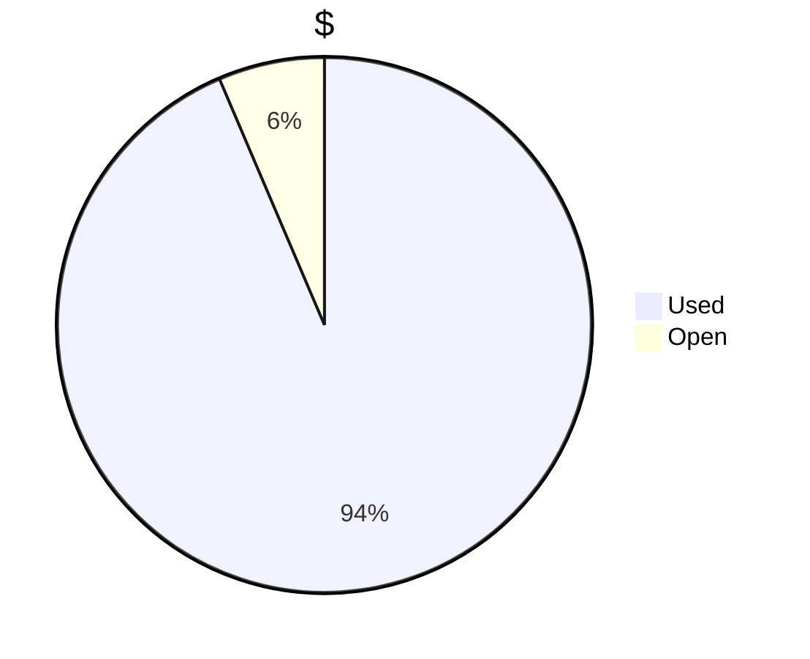
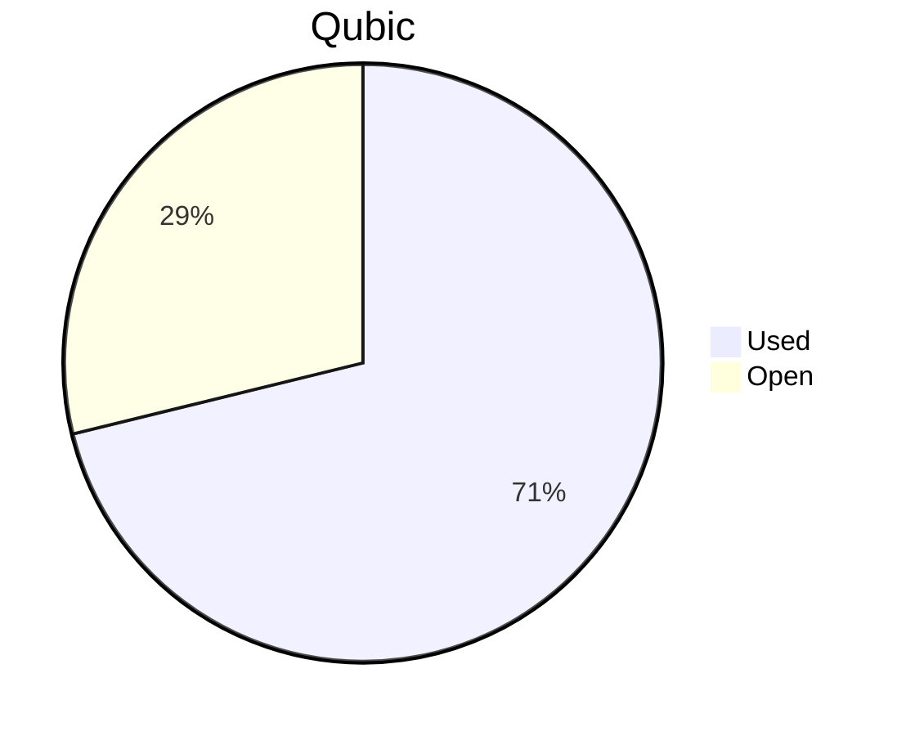

# Financial Reporting February 2025
For February 2025 QCT has spent a total of `52'312'299'568 Qubic`.


For the payments made on the 18.02.2025, `604'960'678 Qubic` have been valued at `1653/bln`.<br>
For the payments made on the 21.02.2025, `28'796'668'511 Qubic` have been valued at `1537/bln`.<br>
For the payments made on the 01.03.2025, `5'003'885'004 Qubic` have been valued at `1287/bln`.<br>
For the payments made on the 02.03.2025,  `16'205'767'732 Qubic` have been valued at `1283/bln`.<br>
For the payments made on the 06.03.2025,  `1'701'017'643 Qubic` have been valued at `1230/bln`.<br>

The different exchange rates are because we do not receive all invoices at the same date.

> Total expenses for February were: ** $74'584.73 $** (paid until 06.03.2025)

## Cost Breakdown

<div style="display: flex; justify-content: center; align-items: center; gap: 10px;flex-wrap:wrap;">
<div>

 ```mermaid
pie title Categories
"Salaries":96.74834091
"Infrastructure":3.251659088

```

</div>
 <div>

 ```mermaid
pie title Categories
"Core":56.14579045
"Integration":25.4913628
"Testing":5.783294046
"Operation":3.251659088
"Overhead":9.32789362

```

 </div>
</div>

## Budget View
> Total available budget for Nov24-Jan25: `300'000 $` or `180'000'000'000 Qubic`.

<div style="display: flex; justify-content: center; align-items: center; gap: 10px;flex-wrap:wrap;">
<div>




</div>
 <div>


 </div>
</div>

>[!NOTE] 
>The current Qubic price still allows QCT to cover partially the next month.

## Included Salaries
Because not all developers receive a fixed salary and they send reports on their worked hours, the monthly budget for salaries fluctuate.<br>
The above numbers include the salaries for December of the following persons:

```
poly
linckode
icyblob
raika sternensucher
fnordspace
cyber-pc
kavatak
yurabb8
wfschrec
mio
luk
phil
```

No payments were executed for the following persons:

``` 
dkat
```


## Transactions


| PayDate    | TargetMonth | Wallet             | Category | $-Qubic/b | Amount $   | Amount Qubic   | TX Link                                                                                            |
| ---------- | ----------- | ------------------ | -------- | --------- | ---------- | -------------- | -------------------------------------------------------------------------------------------------- |
| 18.02.2025 | February    | QCT-Core           | Salary   | 1'653     | $1'000.00  | 604'960'678    | https://explorer.qubic.org/network/tx/myvbynvyhwhnvgkddrfwdofbbdxbpbfrblkjzvikffjoyuyfjrfghoaamfaa |
| 21.02.2025 | February    | QCT-Integration    | Salary   | 1'537     | $4'000.00  | 2'602'472'349  | https://explorer.qubic.org/network/tx/ehespcjhixejtcxjhksjhmnsmgebzwoiopcgbxqbogstqzydnhycvadamaae |
| 21.02.2025 | February    | QCT-Core           | Salary   | 1'537     | $3'000.00  | 1'951'854'262  | https://explorer.qubic.org/network/tx/ghlpiqocngnpeewsxhdflqwaianejpwrbdhjragkogbrbpoainflqxyeciqc |
| 21.02.2025 | February    | QCT-Core           | Salary   | 1'537     | $11'402.42 | 7'418'620'364  | https://explorer.qubic.org/network/tx/ghlpiqocngnpeewsxhdflqwaianejpwrbdhjragkogbrbpoainflqxyeciqc |
| 21.02.2025 | February    | QCT-Core           | Salary   | 1'537     | $9'708.06  | 6'316'239'427  | https://explorer.qubic.org/network/tx/ghlpiqocngnpeewsxhdflqwaianejpwrbdhjragkogbrbpoainflqxyeciqc |
| 21.02.2025 | February    | QCT-Core           | Salary   | 1'537     | $4'000.00  | 2'602'472'349  | https://explorer.qubic.org/network/tx/ghlpiqocngnpeewsxhdflqwaianejpwrbdhjragkogbrbpoainflqxyeciqc |
| 21.02.2025 | February    | QCT-Testing        | Salary   | 1'537     | $3'150.00  | 2'049'446'975  | https://explorer.qubic.org/network/tx/tiglpyvqpsgjtbrjqdnkydfwnhkhcqmtztbtdveirdslywqxuqbnnoqgjmem |
| 21.02.2025 | February    | QCT-Testing        | Salary   | 1'537     | $1'500.00  | 975'927'131    | https://explorer.qubic.org/network/tx/tiglpyvqpsgjtbrjqdnkydfwnhkhcqmtztbtdveirdslywqxuqbnnoqgjmem |
| 21.02.2025 | February    | QCT-Overhead       | Salary   | 1'537     | $7'500.00  | 4'879'635'654  | https://explorer.qubic.org/network/tx/fmogwgncohllwgfrcgmslavvijibaifbnfqfqyuiuczqbjpgjhmzueuerrdg |
| 01.03.2025 | February    | QCT-Integration    | Salary   | 1'287     | $6'440.00  | 5'003'885'004  | https://explorer.qubic.org/network/tx/hvahrocuncoveerjmyxunvnokghczgarlmlqicqcccorcyhvpqxqaivgmwvf |
| 02.03.2025 | February    | QCT-Integration    | Salary   | 1'283     | $7'350.00  | 5'728'760'717  | https://explorer.qubic.org/network/tx/zjwiugkuruhxyblvabiybhpkezaercendgpxzfjjpfzssolgywxewmjachon |
| 02.03.2025 | February    | QCT-Core           | Salary   | 1'283     | $13'442.00 | 10'477'007'015 | https://explorer.qubic.org/network/tx/jehqiiuclpnhsdtngsqpjaezdijasuzahrignhznlflnbiindxilhksfyyzm |
| 06.03.2025 | February    | QCT-Infrastructure | Services | 1'230     | $685.38    | 557'218'618    | https://explorer.qubic.org/network/tx/pxtzvtpvbllmhfgcwauxeihurakbizwvtbzraizfpaiydqphlhxewsoeqyki |
| 06.03.2025 | February    | QCT-Infrastructure | Server   | 1'230     | $283.67    | 230'628'293    | https://explorer.qubic.org/network/tx/pxtzvtpvbllmhfgcwauxeihurakbizwvtbzraizfpaiydqphlhxewsoeqyki |
| 06.03.2025 | February    | QCT-Infrastructure | Server   | 1'230     | $1'123.20  | 913'170'732    | https://explorer.qubic.org/network/tx/pxtzvtpvbllmhfgcwauxeihurakbizwvtbzraizfpaiydqphlhxewsoeqyki |

### Current Balance
https://explorer.qubic.org/network/address/XQCLNHCEHTKQZDBAHJFVVTRMWFACMAZOBAEDQHEITGGEWZDIBRAIYWPGEONG