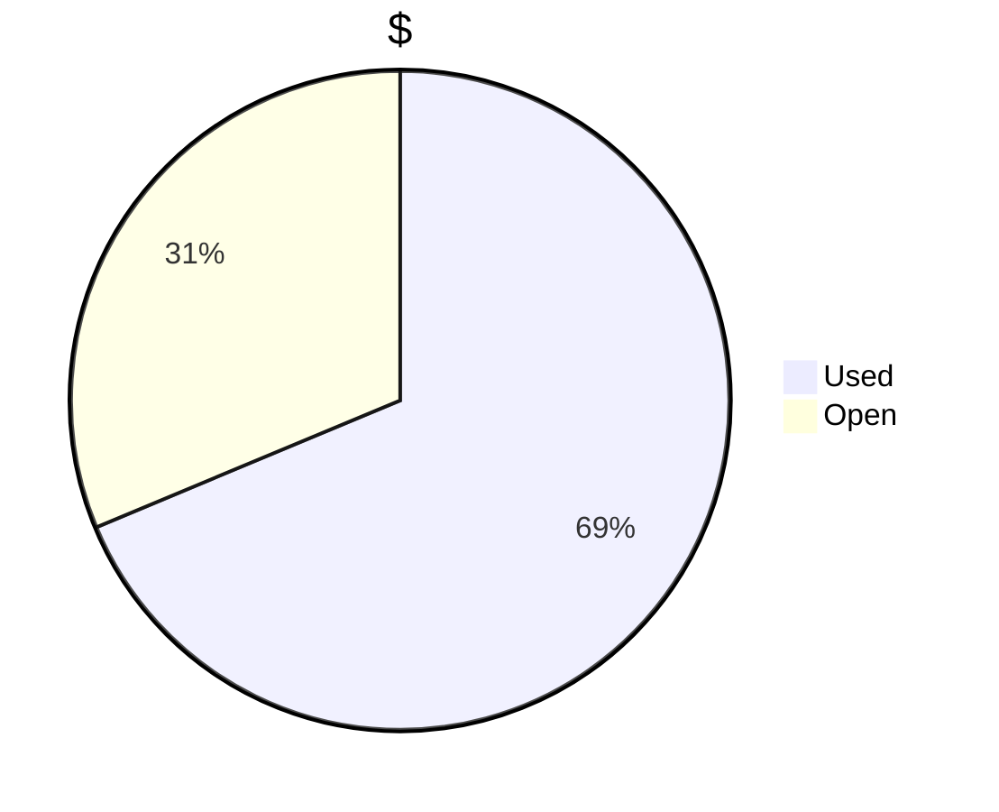
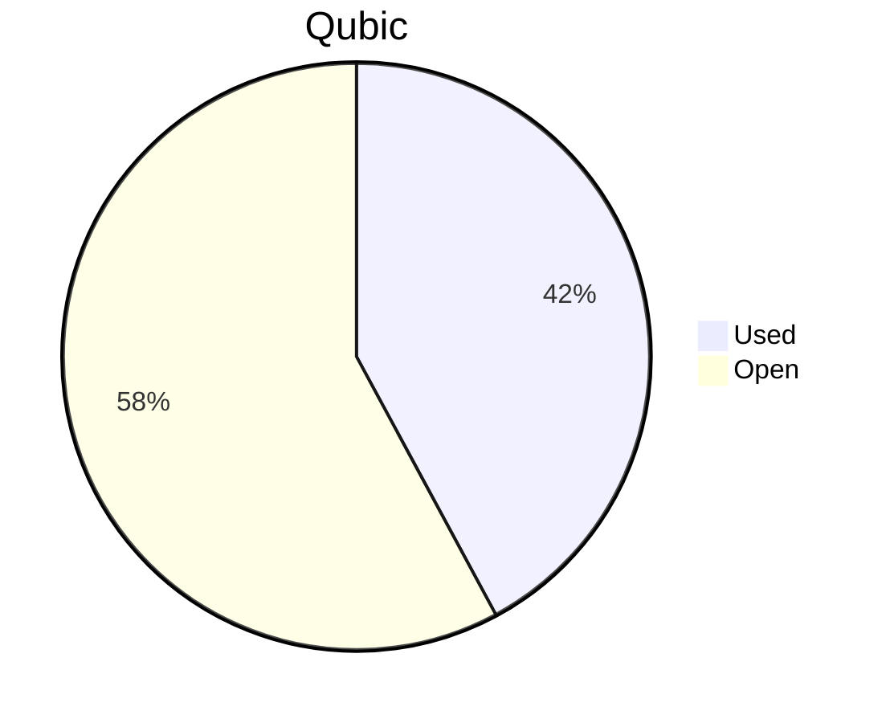

# Financial Reporting January 2025
For January 2025 QCT has spent a total of `33’659’658’339 Qubic`.


For the payments made on the 21.01.2025, `19'142'461'610 Qubic` have been valued at `2373/bln`.<br>
For the payments made on the 01.02.2025 and 03.02.2025, `14'517'196'728 Qubic` have been valued at `2323/bln`.

The different exchange rates are because we do not receive all invoices at the same date.

> Total expenses for January were: **79'148.51 $** (paid until 03.02.2025)

## Cost Breakdown

<div style="display: flex; justify-content: center; align-items: center; gap: 10px;flex-wrap:wrap;">
<div>

 ```mermaid
pie title Categories
"Salaries":96.74207213
"Infrastructure":3.257927867

```

</div>
 <div>

 ```mermaid
pie title Categories
"Core":52.50802658
"Integration":29.02265782
"Testing":5.821642217
"Operation":3.257927867
"Overhead":9.389745511

```

 </div>
</div>

## Budget View
> Total available budget for Nov24-Jan25: `300'000 $` or `180'000'000'000 Qubic`.

<div style="display: flex; justify-content: center; align-items: center; gap: 10px;flex-wrap:wrap;">
<div>




</div>
 <div>



 </div>
</div>

>[!NOTE] 
>The current Qubic price still allows QCT to operate longer than expected.

## Included Salaries
Because not all developers receive a fixed salary and they send reports on their worked hours, the monthly budget for salaries fluctuate.<br>
The above numbers include the salaries for January of the following persons:

```
linckode
icyblob
raika sternensucher
fnordspace
cyber-pc
kavatak
yurabb8
wfschrec
mio
luk
phil
```

No payments were executed for the following persons:

``` 
dkat
```


## Transactions


| Date       | Target Month | Wallet             | Category | $-Qubic/b |   Amount $ |  Amount Qubic | TX Link                                                                                            |
| :--------- | :----------- | :----------------- | :------- | --------: | ---------: | ------------: | :------------------------------------------------------------------------------------------------- |
| 21.01.2025 | January      | QCT-Integration    | Salary   |     2'373 |  $4'000.00 | 1'685'630'004 | https://explorer.qubic.org/network/tx/epgdmjavhtnwictusethtgrjpnoahneradshiqnrwfnnnirasyvqsyghxqab |
| 21.01.2025 | January      | QCT-Core           | Salary   |     2'373 |  $3'000.00 | 1'264'222'503 | https://explorer.qubic.org/network/tx/haiowsxauwpdxadccpnrddhuxpyfmjsgxgauzsqrrbjkgcwzcpfhfjxcztod |
| 21.01.2025 | January      | QCT-Core           | Salary   |     2'373 | $11'299.70 | 4'761'776'233 | https://explorer.qubic.org/network/tx/haiowsxauwpdxadccpnrddhuxpyfmjsgxgauzsqrrbjkgcwzcpfhfjxcztod |
| 21.01.2025 | January      | QCT-Core           | Salary   |     2'373 |  $9'620.60 | 4'054'193'005 | https://explorer.qubic.org/network/tx/haiowsxauwpdxadccpnrddhuxpyfmjsgxgauzsqrrbjkgcwzcpfhfjxcztod |
| 21.01.2025 | January      | QCT-Core           | Salary   |     2'373 |  $4'000.00 | 1'685'630'004 | https://explorer.qubic.org/network/tx/haiowsxauwpdxadccpnrddhuxpyfmjsgxgauzsqrrbjkgcwzcpfhfjxcztod |
| 21.01.2025 | January      | QCT-Testing        | Salary   |     2'373 |  $3'150.00 | 1'327'433'628 | https://explorer.qubic.org/network/tx/tjnbinuixkuiaauhmdoqkhjyufidewxsgsufelikgczcwiblrsdijhoefqsn |
| 21.01.2025 | January      | QCT-Testing        | Salary   |     2'373 |  $1'500.00 |   632'111'252 | https://explorer.qubic.org/network/tx/tjnbinuixkuiaauhmdoqkhjyufidewxsgsufelikgczcwiblrsdijhoefqsn |
| 21.01.2025 | January      | QCT-Overhead       | Salary   |     2'373 |  $7'500.00 | 3'160'556'258 | https://explorer.qubic.org/network/tx/mrixsygcwnqfsccqxymzyraolmofmareajjnwjkoxgaefozpcbmrtfubtuim |
| 21.01.2025 | January      | QCT-Infrastructure | Server   |     2'373 |    $273.17 |   115'114'370 | https://explorer.qubic.org/network/tx/ytlfydvuprewwcemaahrllnyceqeallzfootbbxcpckycfcglkecnpehxxbl |
| 21.01.2025 | January      | QCT-Infrastructure | Server   |     2'373 |  $1'081.60 |   455'794'353 | https://explorer.qubic.org/network/tx/ytlfydvuprewwcemaahrllnyceqeallzfootbbxcpckycfcglkecnpehxxbl |
| 01.02.2025 | January      | QCT-Integration    | Salary   |     2'323 |  $8'697.50 | 3'744'080'930 | https://explorer.qubic.org/network/tx/tfdxcsepsbwgfajqqheedoiaijrdzsrtohvumcpzhceffujrtfvrsgsbvrtg |
| 03.02.2025 | January      | QCT-Integration    | Salary   |     2'323 | $10'080.00 | 4'339'216'530 | https://explorer.qubic.org/network/tx/ribvafancemffhewazgnlmxjdevbrcsjpvfaxmfeleelfbekvuyyvewfywsg |
| 03.02.2025 | January      | QCT-Core           | Salary   |     2'323 |    $901.25 |   387'968'145 | https://explorer.qubic.org/network/tx/yepvjtefjzcivavxslnobuebagdhrgjtuefeeteybhulypdueuqznitaiqja |
| 03.02.2025 | January      | QCT-Core           | Salary   |     2'323 |  $8'394.50 | 3'613'646'147 | https://explorer.qubic.org/network/tx/yepvjtefjzcivavxslnobuebagdhrgjtuefeeteybhulypdueuqznitaiqja |
| 03.02.2025 | January      | QCT-Core           | Salary   |     2'323 |  $4'429.00 | 1'906'586'311 | https://explorer.qubic.org/network/tx/yepvjtefjzcivavxslnobuebagdhrgjtuefeeteybhulypdueuqznitaiqja |
| 03.02.2025 | January      | QCT-Infrastructure | Services |     2'323 |    $587.69 |   252'985'794 | https://explorer.qubic.org/network/tx/yajadeltiyfphdjvewhuwzecqenbboycvqxnltflhcvfkqkctskaxxeanlkj |
| 03.02.2025 | January      | QCT-Infrastructure | Services |     2'323 |    $633.51 |   272'712'871 | https://explorer.qubic.org/network/tx/yajadeltiyfphdjvewhuwzecqenbboycvqxnltflhcvfkqkctskaxxeanlkj |

### Current Balance
> Initial Balance: `xxx Qubic`<br>
> Balance after payments: `xxx Qubic`<br>
> Total expenses at the closure of the period: `xxx Qubic`