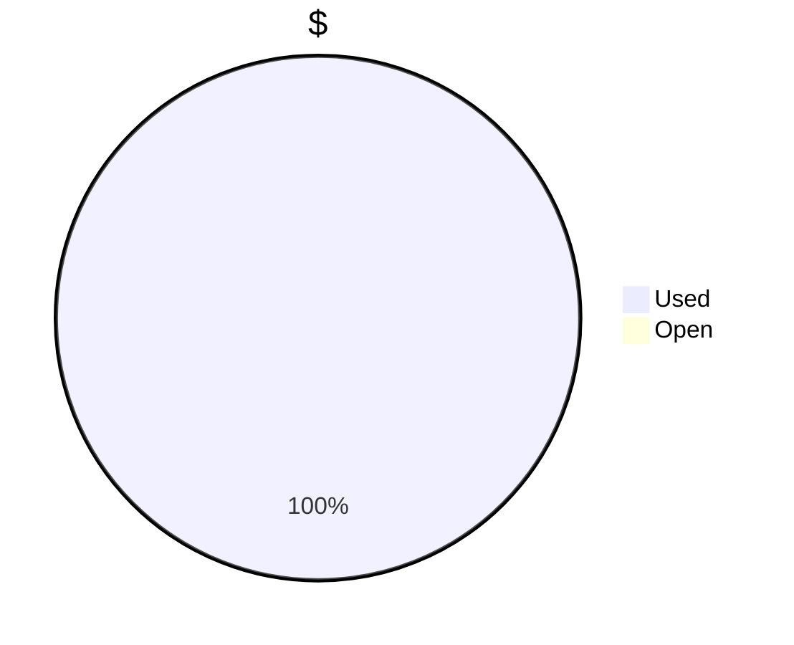
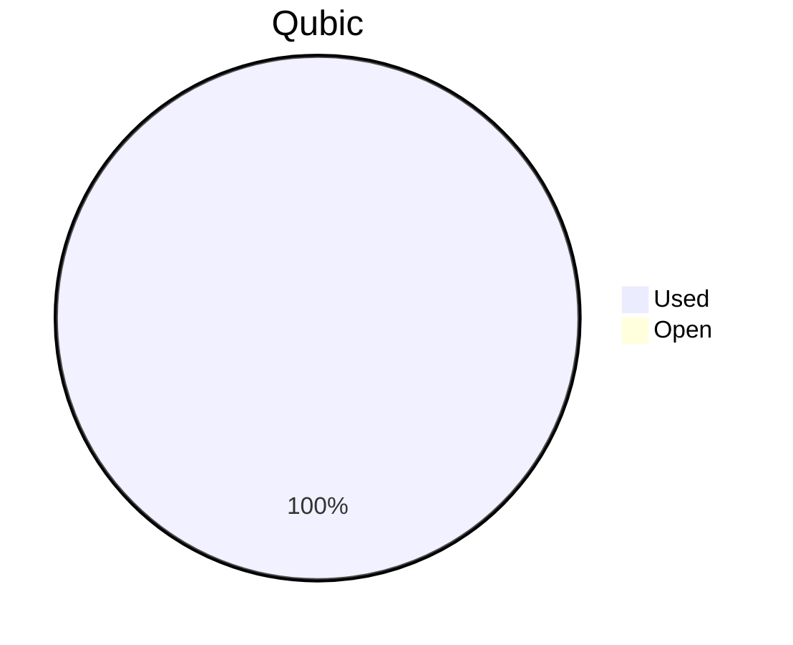

# Financial Reporting March 2025

For March 2025 QCT has paid, up to 04.03.2025, a total of `51'163'338'662 Qubic`.

For the payments made on the 21.03.2025, `37'200'707'083 Qubic` have been valued at `1200/bln`.<br>
For the payments made on the 04.03.2025, `13'962'631'579 Qubic` have been valued at `950/bln`.

The different exchange rates are because we do not receive all invoices at the same date.

> Total cost for March were: **77'815.53 $**
> Total amount paid for March, up to 04.03.2025, was: **57'905.35 $**
> The estimated pending payments for March are: **19'910.19 $**. At a value of `800/bln` USD per billion Qubics, this would be `25'122'106'833 Qubic`.

## Cost Breakdown

<div style="display: flex; justify-content: center; align-items: center; gap: 10px;flex-wrap:wrap;">
<div>

 ```mermaid
pie title Categories
"Salaries":96.03771272
"Infrastructure":3.962287276

```

</div>
 <div>

 ```mermaid
pie title Categories
"Core":49.4262111
"Integration":27.95186971
"Testing":5.079605913
"Operation":3.962287276
"Overhead":13.580026

```

 </div>
</div>

## Budget View
> Total available budget for Nov24-Jan25: `300'000 $` or `180'000'000'000 Qubic`.

<div style="display: flex; justify-content: center; align-items: center; gap: 10px;flex-wrap:wrap;">
<div>




</div>
 <div>



 </div>
</div>

>[!NOTE] 
>The current Qubic price did not allow to complete the execution of the payments for March.


## Included Salaries
Because not all developers receive a fixed salary and they send reports on their worked hours, the monthly budget for salaries fluctuate.<br>
The above numbers include the salaries for March of the following persons:

```
linckode
icyblob
raika sternensucher
fnordspace
cyber-pc
kavatak
yurabb8
wfschrec
phil
mio
luk
AndyQus
```

No payments were due for the following persons:

``` 
dkat
```


## Transactions


| PayDate    | TargetMonth | Wallet          | Category | $-Qubic/b |   Amount $ |   Amount Qubic | TX Link                                                                                            |
| :--------- | :---------- | :-------------- | :------- | --------: | ---------: | -------------: | :------------------------------------------------------------------------------------------------- |
| 21.03.2025 | March       | QCT-Integration | Salary   |      1200 |  $4'000.00 |  3'333'333'333 | https://explorer.qubic.org/network/tx/rkwlbpfilajylauovutsqfcdyrwacawxzvypsfqticipjylpulugynzgdaqd |
| 21.03.2025 | March       | QCT-Core        | Salary   |      1200 |  $3'000.00 |  2'500'000'000 | https://explorer.qubic.org/network/tx/cmnqqjjvxbukufoxlbxrbmxfezggixnyzxwmhkloidonxclgmjetlzfdubfj |
| 21.03.2025 | March       | QCT-Core        | Salary   |      1200 | $11'607.87 |  9'673'223'750 | https://explorer.qubic.org/network/tx/cmnqqjjvxbukufoxlbxrbmxfezggixnyzxwmhkloidonxclgmjetlzfdubfj |
| 21.03.2025 | March       | QCT-Core        | Salary   |      1200 |  $9'882.98 |  8'235'816'667 | https://explorer.qubic.org/network/tx/cmnqqjjvxbukufoxlbxrbmxfezggixnyzxwmhkloidonxclgmjetlzfdubfj |
| 21.03.2025 | March       | QCT-Core        | Salary   |      1200 |  $4'000.00 |  3'333'333'333 | https://explorer.qubic.org/network/tx/cmnqqjjvxbukufoxlbxrbmxfezggixnyzxwmhkloidonxclgmjetlzfdubfj |
| 21.03.2025 | March       | QCT-Testing     | Salary   |      1200 |  $3'150.00 |  2'625'000'000 | https://explorer.qubic.org/network/tx/auepoessychygdgzfbtjcfyucnmfatrnpfiobczevgnaechfvtkseuwgkkwb |
| 21.03.2025 | March       | QCT-Testing     | Salary   |      1200 |  $1'500.00 |  1'250'000'000 | https://explorer.qubic.org/network/tx/auepoessychygdgzfbtjcfyucnmfatrnpfiobczevgnaechfvtkseuwgkkwb |
| 21.03.2025 | March       | QCT-Overhead    | Salary   |      1200 |  $7'500.00 |  6'250'000'000 | https://explorer.qubic.org/network/tx/cpvgdncfmolkdadpeyjdhckkmbbhlylnwrbwqneavbyvyojoecpaloghstbh |
| 03.03.2025 | March       | QCT-Core        | Salary   |       950 | $13'264.50 | 13'962'631'579 | https://explorer.qubic.org/network/tx/sgkqdkygfgizncdeqbknodgxcuehyxqyxndpinhljamkgsiznmdhqtmcxjkd |


### Current Balance

> Initial Balance: `xxx Qubic`
> Balance after payments: `714,543,000 Qubic`
> Total expenses at the closure of the period: `204,407,608,972 Qubic`

https://explorer.qubic.org/network/address/XQCLNHCEHTKQZDBAHJFVVTRMWFACMAZOBAEDQHEITGGEWZDIBRAIYWPGEONG