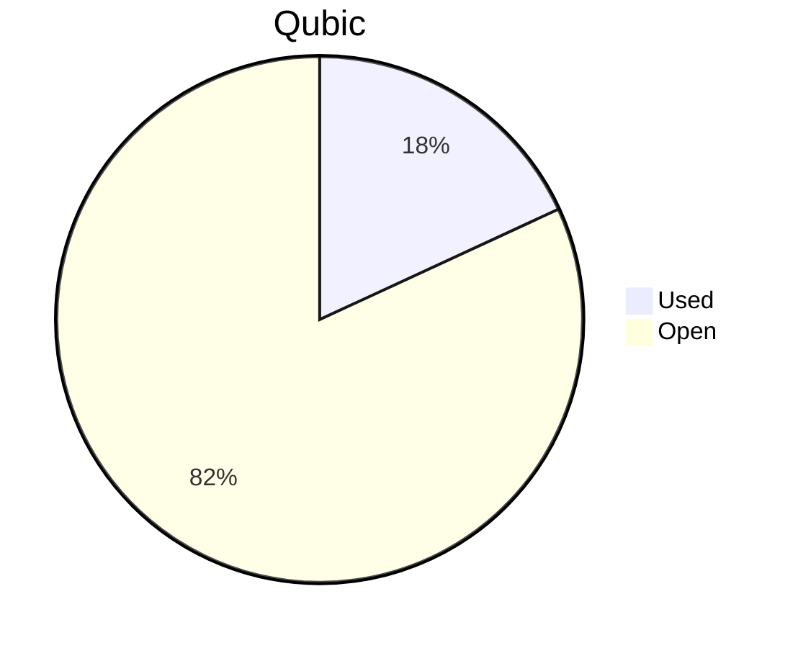

# Financial Reporting April 2025
For April 2025 QCT has spent a total of `52'146'357'466 Qubic`.

For the payments made on the 13.04.2025, `1'000'000 Qubic` have been valued at `1300/bln`.<br>
For the payments made between the 16.04.2025 and 18.04.2025, `15'720'433'811 Qubic` have been valued at `1290/bln`.<br>
For the payments made on the 21.04.2025, `26'291'600'928 Qubic` have been valued at `1293/bln`.<br>
For the payments made on the 02.05.2025, `3'500'000'000 Qubic` have been valued at `1400/bln`.<br>
For the payments made on the 05.05.2025, `6'633'322'727 Qubic` have been valued at `1397/bln`.<br>

The different exchange rates are because we do not receive all invoices at the same date.

> An amount of **20'280.66 $** was allocated to settle outstanding payments from the previous month, which had been deferred due to insufficient funds prior to the approval of new budget.<br>
> The team incurred a total of **48'161.79 $** in April, corresponding solely to April-related expenses.<br>
> Total expenses for April were: **68'442.45 $** (paid until 05.05.2025)

## Cost Breakdown

<div style="display: flex; justify-content: center; align-items: center; gap: 10px;flex-wrap:wrap;">
<div>

 ```mermaid
pie title Categories
"Salaries":92.608688479746
"Infrastructure":7.39131152025402
```

</div>
 <div>

 ```mermaid
pie title Categories
"Core":26.0730579013392
"Integration":43.9780419242571
"Testing":6.79402899860283
"Operation":0
"Overhead":15.7635596555468
```

 </div>
</div>

## Budget View
> Total available budget for April-June 2025: `288'000'000'000 Qubic`.

<div style="display: flex; justify-content: center; align-items: center; gap: 10px;flex-wrap:wrap;">
<div>



 </div>
</div>

## Included Salaries
Because not all developers receive a fixed salary and they send reports on their worked hours, the monthly budget for salaries fluctuate.<br>

The above numbers include the salaries for March of the following persons:

```
AndyQus
mio
luk
```

and the salaries for April of the following persons:

```
wfschrec
icyblob
fnordspace
cyber-pc
kavatak
yurabb8
linckode
mio
luk
```

## Transactions


| Date       | Target Month | Wallet             | Category | $-Qubic/b |   Amount $ |  Amount Qubic | TX Link                                                                                            |
| :--------- | :----------- | :----------------- | :------- | --------: | ---------: | ------------: | :------------------------------------------------------------------------------------------------- |
| 13.04.2025 | March        | QCT-Overhead       | Services |      1300 |      $1.30 |     1'000'000 | https://explorer.qubic.org/network/tx/expxiuttczbxlchkdwieafymzcjcehcgrnmiikolpgbiqikwobxjwyldiosa |
| 16.04.2025 | March        | QCT-Infrastructure | Server   |      1290 |    $554.08 |   429'518'372 | https://explorer.qubic.org/network/tx/hbpxhyhrkvlgoacvymgfwsdizttcdjqnmmaxvamviadigxibighalxqfqcll |
| 16.04.2025 | March        | QCT-Infrastructure | Server   |      1290 |  $1'154.40 |   894'883'721 | https://explorer.qubic.org/network/tx/hbpxhyhrkvlgoacvymgfwsdizttcdjqnmmaxvamviadigxibighalxqfqcll |
| 16.04.2025 | March        | QCT-Infrastructure | Services |      1290 |    $776.47 |   601'915'116 | https://explorer.qubic.org/network/tx/hbpxhyhrkvlgoacvymgfwsdizttcdjqnmmaxvamviadigxibighalxqfqcll |
| 16.04.2025 | March        | QCT-Overhead       | Salary   |      1290 |  $3'287.67 | 2'548'578'811 | https://explorer.qubic.org/network/tx/ffvhyoymtltpzdntjkwyizacavvcmfbqamhjycoiahttiitphflvkvofjvrf |
| 16.04.2025 | March        | QCT-Integration    | Salary   |      1290 |  $8'954.40 | 6'941'395'349 | https://explorer.qubic.org/network/tx/ksnqvjxitylhzgjxzoiengpojqlanqxqivpsjdtevdxzsagnwoorugmefuxo |
| 17.04.2025 | March        | QCT-Integration    | Salary   |      1290 |  $5'250.00 | 4'069'767'442 | https://explorer.qubic.org/network/tx/ksnqvjxitylhzgjxzoiengpojqlanqxqivpsjdtevdxzsagnwoorugmefuxo |
| 18.04.2025 | March        | QCT-Integration    | Salary   |      1290 |    $302.34 |   234'375'000 | https://explorer.qubic.org/network/tx/ksnqvjxitylhzgjxzoiengpojqlanqxqivpsjdtevdxzsagnwoorugmefuxo |
| 21.04.2025 | April        | QCT-Overhead       | Salary   |      1293 |  $7'500.00 | 5'800'464'037 | https://explorer.qubic.org/network/tx/yzpihwrzlivlmbuqqihdmippsyecwvoujprocpfqwbtvmqookxuulujgjcob |
| 21.04.2025 | April        | QCT-Core           | Salary   |      1293 |  $3'000.00 | 2'320'185'615 | https://explorer.qubic.org/network/tx/aosubutvbpmgqfiwzzydhsqdpmcgzyhnawtcvmcsogahxvzlhibveqeahknk |
| 21.04.2025 | April        | QCT-Core           | Salary   |      1293 | $10'845.04 | 8'387'501'933 | https://explorer.qubic.org/network/tx/aosubutvbpmgqfiwzzydhsqdpmcgzyhnawtcvmcsogahxvzlhibveqeahknk |
| 21.04.2025 | April        | QCT-Core           | Salary   |      1293 |  $4'000.00 | 3'093'580'820 | https://explorer.qubic.org/network/tx/aosubutvbpmgqfiwzzydhsqdpmcgzyhnawtcvmcsogahxvzlhibveqeahknk |
| 21.04.2025 | April        | QCT-Testing        | Salary   |      1293 |  $3'150.00 | 2'436'194'896 | https://explorer.qubic.org/network/tx/zvadligkpphoybiefleeftkhlxccgorxrkzqeupsuggowkenneerdeidlwna |
| 21.04.2025 | April        | QCT-Testing        | Salary   |      1293 |  $1'500.00 | 1'160'092'807 | https://explorer.qubic.org/network/tx/zvadligkpphoybiefleeftkhlxccgorxrkzqeupsuggowkenneerdeidlwna |
| 21.04.2025 | April        | QCT-Integration    | Salary   |      1293 |  $4'000.00 | 3'093'580'820 | https://explorer.qubic.org/network/tx/gdodfrkaghgdjgtnkbogwwqaztsbrsfbdcmadtgoffugmultvcpdehpdjova |
| 02.05.2025 | April        | QCT-Integration    | Salary   |      1400 |  $4'900.00 | 3'500'000'000 | https://explorer.qubic.org/network/tx/jfgxxqvubsxbhaminubunarqbciddkcpfbltuiwnceideexanoulfechsrcc |
| 05.05.2025 | April        | QCT-Integration    | Salary   |      1397 |  $6'300.00 | 4'509'663'565 | https://explorer.qubic.org/network/tx/usfyrralgsuawbaprsabapoqadmammdoczizjfgnbdejpultylxyjjrgnric |
| 05.05.2025 | April        | QCT-Integration    | Salary   |      1397 |    $392.91 |   281'250'000 | https://explorer.qubic.org/network/tx/usfyrralgsuawbaprsabapoqadmammdoczizjfgnbdejpultylxyjjrgnric |
| 05.05.2025 | April        | QCT-Infrastructure | Server   |      1397 |    $637.21 |   456'125'268 | https://explorer.qubic.org/network/tx/ovwzxzkwhwmiufsjdnklpqnqmchghqrsubtiziwhjgrmvclzeurixfchdfvb |
| 05.05.2025 | April        | QCT-Infrastructure | Server   |      1397 |  $1'175.20 |   841'231'210 | https://explorer.qubic.org/network/tx/ovwzxzkwhwmiufsjdnklpqnqmchghqrsubtiziwhjgrmvclzeurixfchdfvb |
| 05.05.2025 | April        | QCT-Infrastructure | Services |      1397 |    $761.44 |   545'052'684 | https://explorer.qubic.org/network/tx/ovwzxzkwhwmiufsjdnklpqnqmchghqrsubtiziwhjgrmvclzeurixfchdfvb |


### Current Balance

> Balance after payments: `236,568,185,534 Qubic`<br>