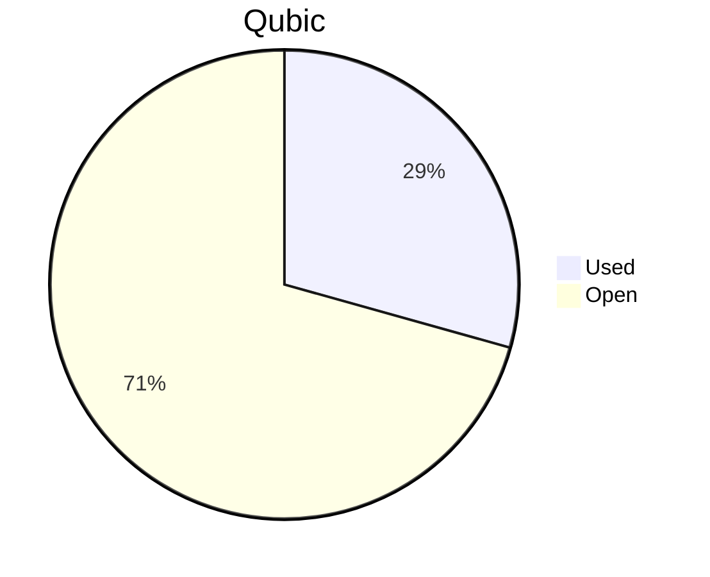

# Financial Reporting May 2025
For May 2025 QCT has spent a total of `32'362'629'716 Qubic`.

For the payments made on the 25.05.2025, `19'453'155'949 Qubic` have been valued at `1353/bln`.<br>
For the payments made on the 03.06.2025, `10'675'215'135 Qubic` have been valued at `1470/bln`.<br>
For the payments made on the 04.06.2025, `2'234'258'632 Qubic` have been valued at `1477/bln`.<br>

The different exchange rates are because we do not receive all invoices at the same date.

> Total expenses for May were: **45'312.69 $** (paid until 04.06.2025)

## Cost Breakdown

<div style="display: flex; justify-content: center; align-items: center; gap: 10px;flex-wrap:wrap;">
<div>

 ```mermaid
pie title Categories
"Salaries":86.7250807713921
"Infrastructure":13.2749192286079
```

</div>
 <div>

 ```mermaid
pie title Categories
"Core":38.9959666096821
"Integration":37.4670873766615
"Testing":10.2620267850485
"Operation":0
"Overhead":0
```

 </div>
</div>

## Budget View
> Total available budget for April-June 2025: `288'000'000'000 Qubic`.

<div style="display: flex; justify-content: center; align-items: center; gap: 10px;flex-wrap:wrap;">
<div>



 </div>
</div>

## Included Salaries
Because not all developers receive a fixed salary and they send reports on their worked hours, the monthly budget for salaries fluctuate.<br>
The above numbers include the salaries for May of the following persons:

```
linckode
kavatak
yurabb8
icyblob
fnordspace
cyber-pc
luk
mio
```

## Transactions


| Date       | Target Month | Wallet             | Category | $-Qubic/b |   Amount $ |  Amount Qubic | TX Link                                                                                            |
| :--------- | :----------- | :----------------- | :------- | --------: | ---------: | ------------: | :------------------------------------------------------------------------------------------------- |
| 25.05.2025 | May          | QCT-Integration    | Salary   |      1353 |  $4'000.00 | 2'956'393'200 | https://explorer.qubic.org/network/tx/cmzhncspeeuecckijydjdgwbsbddsgbolzpcfarcweqvjfucdmtndvqaykra |
| 25.05.2025 | May          | QCT-Testing        | Salary   |      1353 |  $3'150.00 | 2'328'159'645 | https://explorer.qubic.org/network/tx/burgdslowppjbhgteyazbmfdeucenevhqfqtygeggethzdpfontkzrndqusg |
| 25.05.2025 | May          | QCT-Testing        | Salary   |      1353 |  $1'500.00 | 1'108'647'450 | https://explorer.qubic.org/network/tx/burgdslowppjbhgteyazbmfdeucenevhqfqtygeggethzdpfontkzrndqusg |
| 25.05.2025 | May          | QCT-Core           | Salary   |      1353 |  $3'000.00 | 2'217'294'900 | https://explorer.qubic.org/network/tx/svezzdhvxroahdqlxamwbftfztzeatcgemfihgitzfiuywlqnlnrbvpdloye |
| 25.05.2025 | May          | QCT-Core           | Salary   |      1353 | $10'670.12 | 7'886'267'554 | https://explorer.qubic.org/network/tx/svezzdhvxroahdqlxamwbftfztzeatcgemfihgitzfiuywlqnlnrbvpdloye |
| 25.05.2025 | May          | QCT-Core           | Salary   |      1353 |  $4'000.00 | 2'956'393'200 | https://explorer.qubic.org/network/tx/svezzdhvxroahdqlxamwbftfztzeatcgemfihgitzfiuywlqnlnrbvpdloye |
| 03.06.2025 | May          | QCT-Integration    | Salary   |      1470 |  $7'350.00 | 5'000'000'000 | https://explorer.qubic.org/network/tx/tjkdaykptzqdkhfbvcjukhpfgofajhcmlruaqflmabpfhtcriyangqxcsptm |
| 03.06.2025 | May          | QCT-Integration    | Salary   |      1470 |    $482.34 |   328'125'000 | https://explorer.qubic.org/network/tx/tjkdaykptzqdkhfbvcjukhpfgofajhcmlruaqflmabpfhtcriyangqxcsptm |
| 03.06.2025 | May          | QCT-Integration    | Salary   |      1470 |  $5'145.00 | 3'500'000'000 | https://explorer.qubic.org/network/tx/tjkdaykptzqdkhfbvcjukhpfgofajhcmlruaqflmabpfhtcriyangqxcsptm |
| 03.06.2025 | May          | QCT-Infrastructure | Server   |      1470 |    $778.95 |   529'898'367 | https://explorer.qubic.org/network/tx/askgfixhjeyjxayqxjjsumeaptldxrjjdsktonmsaeudurveskdkjumgxtxl |
| 03.06.2025 | May          | QCT-Infrastructure | Server   |      1470 |  $1'185.60 |   806'530'612 | https://explorer.qubic.org/network/tx/askgfixhjeyjxayqxjjsumeaptldxrjjdsktonmsaeudurveskdkjumgxtxl |
| 03.06.2025 | May          | QCT-Infrastructure | Services |      1470 |    $750.67 |   510'661'156 | https://explorer.qubic.org/network/tx/askgfixhjeyjxayqxjjsumeaptldxrjjdsktonmsaeudurveskdkjumgxtxl |
| 04.06.2025 | May          | QCT-Infrastructure | Services |      1477 |  $3'300.00 | 2'234'258'632 | https://explorer.qubic.org/network/tx/jwlowhlxdghetdlkosbyhqdwqcbgtyknnnlnivymoeorrfglhqyoukabalaj |

### Current Balance

> Balance after payments: `204,205,555,818 Qubic`<br>