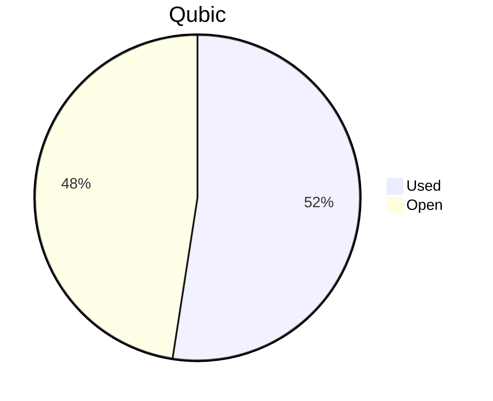

# Financial Reporting June 2025
For June 2025 QCT has spent a total of `67'265'915'618 Qubic`.

For the payments made on the 20.06.2025, `15'636'278'780 Qubic` have been valued at `1607/bln`.<br>
For the payments made on the 26.06.2025, `30'997'832'370 Qubic` have been valued at `1557/bln`.<br>
For the payments made on the 01.07.2025, `341'763'500 Qubic` have been valued at `1463/bln`.<br>
For the payments made on the 02.07.2025, `10'055'482'145 Qubic` have been valued at `1403/bln`.<br>
For the payments made on the 03.07.2025, `10'234'558'823 Qubic` have been valued at `1360/bln`.<br>

The different exchange rates are because we do not receive all invoices at the same date.

> Total expenses for May were: **101'917.97 $** (paid until 03.07.2025)

## Cost Breakdown

<div style="display: flex; justify-content: center; align-items: center; gap: 10px;flex-wrap:wrap;">
<div>

 ```mermaid
pie title Categories
"Salaries":96.084659713106
"Infrastructure":3.91534028689404
```


</div>
 <div>

 ```mermaid
pie title Categories
"Core":79.0833332016506
"Integration":11.9482429586879
"Testing":5.05308355276745
"Operation":0
"Overhead":0
```

 </div>
</div>

## Budget View
> Total available budget for April-June 2025: `288'000'000'000 Qubic`.

<div style="display: flex; justify-content: center; align-items: center; gap: 10px;flex-wrap:wrap;">
<div>



 </div>
</div>

## Included Salaries
Because not all developers receive a fixed salary and they send reports on their worked hours, the monthly budget for salaries fluctuate.<br>
The above numbers include the salaries for June of the following persons:

```
icyblob
fnordspace
cyber-pc
raika sternensucher
kavatak
yurabb8
mio
luk
linckode
phil
```

Also, some salaries from previous months are included due to administrative delays.
Salaries for May for the following persons:
```
raika sternensucher
phil
```

Salary for April for:
```
phil
```

## Transactions


| Date       | Target Month | Wallet             | Category | $-Qubic/b |   Amount $ |  Amount Qubic | TX Link                                                                                            |
| :--------- | :----------- | :----------------- | :------- | --------: | ---------: | ------------: | :------------------------------------------------------------------------------------------------- |
| 20.06.2025 | April        | QCT-Core           | Salary   |      1607 | $11'758.75 | 7'317'205'974 | https://explorer.qubic.org/network/tx/vagknbruqcqitebxwetmnvhluwrbfzbzlypsjytlweilzsbyvqddjojbviki |
| 20.06.2025 | May          | QCT-Core           | Salary   |      1607 | $13'368.75 | 8'319'072'806 | https://explorer.qubic.org/network/tx/kquqkysofdrmvdrlnzhsyssdkbacpnqrrptowwlxngaorxpyjhzjwsedvaxb |
| 26.06.2025 | May          | QCT-Core           | Salary   |      1557 | $12'840.56 | 8'246'989'403 | https://explorer.qubic.org/network/tx/odefmuxgbanaygxipgfyvehqkvfgawukghoahrjlnawuxtjafddmuxfexrlm |
| 26.06.2025 | June         | QCT-Core           | Salary   |      1557 |  $3'000.00 | 1'926'782'274 | https://explorer.qubic.org/network/tx/cmszaprbpvnpxgakbwfirbrhsalgrvapyvodxbvifhbibzxzurgrwibbqhgg |
| 26.06.2025 | June         | QCT-Core           | Salary   |      1557 | $10'932.50 | 7'021'515'735 | https://explorer.qubic.org/network/tx/cmszaprbpvnpxgakbwfirbrhsalgrvapyvodxbvifhbibzxzurgrwibbqhgg |
| 26.06.2025 | June         | QCT-Core           | Salary   |      1557 |  $4'000.00 | 2'569'043'031 | https://explorer.qubic.org/network/tx/cmszaprbpvnpxgakbwfirbrhsalgrvapyvodxbvifhbibzxzurgrwibbqhgg |
| 26.06.2025 | June         | QCT-Core           | Salary   |      1557 | $12'840.56 | 8'246'989'403 | https://explorer.qubic.org/network/tx/cmszaprbpvnpxgakbwfirbrhsalgrvapyvodxbvifhbibzxzurgrwibbqhgg |
| 26.06.2025 | June         | QCT-Testing        | Salary   |      1557 |  $3'150.00 | 2'023'121'387 | https://explorer.qubic.org/network/tx/fctwbzwswmabkcxnbscvyixhwtsdeqxnhmfnixxkvaemjgxxoqcrnmogjrue |
| 26.06.2025 | June         | QCT-Testing        | Salary   |      1557 |  $1'500.00 |   963'391'137 | https://explorer.qubic.org/network/tx/fctwbzwswmabkcxnbscvyixhwtsdeqxnhmfnixxkvaemjgxxoqcrnmogjrue |
| 01.07.2025 | June         | QCT-Testing        | Salary   |      1463 |    $500.00 |   341'763'500 | https://explorer.qubic.org/network/tx/iuzlcudibrniiastqltudviwievfjiyesbmytespugcthzvtdgbmtqleppxd |
| 02.07.2025 | June         | QCT-Integration    | Salary   |      1403 |  $4'910.50 | 3'500'000'000 | https://explorer.qubic.org/network/tx/dwyalbmngakggdjnidsvarnmiwgedewcowqwuwdhgdtyoxrgzxdmjsufnhoc |
| 02.07.2025 | June         | QCT-Integration    | Salary   |      1403 |  $4'900.00 | 3'492'516'037 | https://explorer.qubic.org/network/tx/dwyalbmngakggdjnidsvarnmiwgedewcowqwuwdhgdtyoxrgzxdmjsufnhoc |
| 02.07.2025 | June         | QCT-Integration    | Salary   |      1403 |    $306.91 |   218'750'000 | https://explorer.qubic.org/network/tx/dwyalbmngakggdjnidsvarnmiwgedewcowqwuwdhgdtyoxrgzxdmjsufnhoc |
| 02.07.2025 | June         | QCT-Infrastructure | Server   |      1403 |    $841.75 |   599'966'500 | https://explorer.qubic.org/network/tx/oexyjjiyuizbegsjralvxdgvrjpgrmsdzdtqzwatbhmfwinlfwlxproenzbk |
| 02.07.2025 | June         | QCT-Infrastructure | Server   |      1403 |  $1'227.20 |   874'697'078 | https://explorer.qubic.org/network/tx/oexyjjiyuizbegsjralvxdgvrjpgrmsdzdtqzwatbhmfwinlfwlxproenzbk |
| 02.07.2025 | June         | QCT-Infrastructure | Services |      1403 |    $821.48 |   585'518'318 | https://explorer.qubic.org/network/tx/oexyjjiyuizbegsjralvxdgvrjpgrmsdzdtqzwatbhmfwinlfwlxproenzbk |
| 02.07.2025 | June         | QCT-Infrastructure | Services |      1403 |  $1'100.00 |   784'034'212 | https://explorer.qubic.org/network/tx/oexyjjiyuizbegsjralvxdgvrjpgrmsdzdtqzwatbhmfwinlfwlxproenzbk |
| 03.07.2025 | June         | QCT-Integration    | Salary   |      1360 |  $2'060.00 | 1'514'705'882 | https://explorer.qubic.org/network/tx/tsafkwfdaompsglvvgzjvniwnbtcvnffvxnnmqmilamioqiuemcvjcpdvpjh |
| 03.07.2025 | June         | QCT-Core           | Salary   |      1360 | $11'859.00 | 8'719'852'941 | https://explorer.qubic.org/network/tx/wkobpsnzjlxyhbakfbgpapywsbggztefprvfjdgcghtsjdncgrfrokpezbrh |

### Current Balance

> Balance after payments: `136'939'640'200 Qubic`<br>