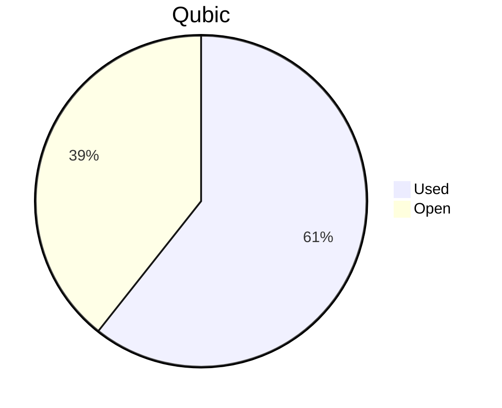

# Financial Reporting July 2025
For July 2025 QCT has spent a total of `23'644'997'118 Qubic`.

For the payments made on the 25.07.2025, `16'899'039'308 Qubic` have been valued at `2137/bln`.<br>
For the payments made on the 02.08.2025, `5'307'747'667 Qubic` have been valued at `2643/bln`.<br>
For the payments made on the 03.08.2025, `1'438'210'143 Qubic` have been valued at `2538/bln`.<br>

The different exchange rates are because we do not receive all invoices at the same date.

> Total expenses for July were: **53'856.52 $** (paid until 03.08.2025)

## Cost Breakdown

<div style="display: flex; justify-content: center; align-items: center; gap: 10px;flex-wrap:wrap;">
<div>

 ```mermaid
pie title Categories
"Salaries":93.1022339745128
"Infrastructure":6.89776602548723
```


</div>
 <div>

 ```mermaid
pie title Categories
"Core":63.0921686783436
"Integration":20.4476206459546
"Testing":9.56244465021457
"Operation":0
"Overhead":0
```

 </div>
</div>

## Budget View
> Total available budget for April-June 2025: `288'000'000'000 Qubic`.

<div style="display: flex; justify-content: center; align-items: center; gap: 10px;flex-wrap:wrap;">
<div>



 </div>
</div>

## Included Salaries
Because not all developers receive a fixed salary and they send reports on their worked hours, the monthly budget for salaries fluctuate.<br>
The above numbers include the salaries for July of the following persons:

```
icyblob
fnordspace
cyber-pc
raika sternensucher
kavatak
yurabb8
luk
mio
phil
```

## Transactions


| Date       | Target Month | Wallet             | Category | $-Qubic/b |   Amount $ |  Amount Qubic | TX Link                                                                                            |
| :--------- | :----------- | :----------------- | :------- | --------: | ---------: | ------------: | :------------------------------------------------------------------------------------------------- |
| 25.07.2025 | July         | QCT-Core           | Salary   |      2137 |  $3'000.00 | 1'403'837'155 | https://explorer.qubic.org/network/tx/mdmybzyrsmoiyaiwfgewhkomesabrpyfhlhazlhidaocdkmeugnjqfrghxik |
| 25.07.2025 | July         | QCT-Core           | Salary   |      2137 | $11'019.96 | 5'156'743'098 | https://explorer.qubic.org/network/tx/mdmybzyrsmoiyaiwfgewhkomesabrpyfhlhazlhidaocdkmeugnjqfrghxik |
| 25.07.2025 | July         | QCT-Core           | Salary   |      2137 |  $4'000.00 | 1'871'782'873 | https://explorer.qubic.org/network/tx/mdmybzyrsmoiyaiwfgewhkomesabrpyfhlhazlhidaocdkmeugnjqfrghxik |
| 25.07.2025 | July         | QCT-Core           | Salary   |      2137 | $12'943.29 | 6'056'755'732 | https://explorer.qubic.org/network/tx/mdmybzyrsmoiyaiwfgewhkomesabrpyfhlhazlhidaocdkmeugnjqfrghxik |
| 25.07.2025 | July         | QCT-Testing        | Salary   |      2137 |  $3'150.00 | 1'474'029'013 | https://explorer.qubic.org/network/tx/uwnfawhzaneshdenokfgkysphldeqrbwizsfdkxdjdfequfleyicsbnffpqm |
| 25.07.2025 | July         | QCT-Testing        | Salary   |      2137 |  $2'000.00 |   935'891'437 | https://explorer.qubic.org/network/tx/uwnfawhzaneshdenokfgkysphldeqrbwizsfdkxdjdfequfleyicsbnffpqm |
| 02.08.2025 | July         | QCT-Integration    | Salary   |      2643 |  $4'060.00 | 1'536'133'182 | https://explorer.qubic.org/network/tx/azemjwoswhahfhnydnogoyxkuffcfimojctmutmelazuvjsdmktpfjcgappm |
| 02.08.2025 | July         | QCT-Integration    | Salary   |      2643 |    $479.04 |   181'250'000 | https://explorer.qubic.org/network/tx/azemjwoswhahfhnydnogoyxkuffcfimojctmutmelazuvjsdmktpfjcgappm |
| 02.08.2025 | July         | QCT-Integration    | Salary   |      2643 |  $6'473.33 | 2'449'236'978 | https://explorer.qubic.org/network/tx/azemjwoswhahfhnydnogoyxkuffcfimojctmutmelazuvjsdmktpfjcgappm |
| 02.08.2025 | July         | QCT-Core           | Salary   |      2643 |  $3'016.00 | 1'141'127'507 | https://explorer.qubic.org/network/tx/jtlsmmbwodfvadltogfrqnrutdmewaoxeubpoiwicbuwajbgbeyvbldanyyj |
| 03.08.2025 | July         | QCT-Infrastructure | Server   |      2583 |    $982.67 |   380'437'786 | https://explorer.qubic.org/network/tx/fqcbojzwbqeyfeinucgqwoevbfyacmovsakbtlzmbdmmbsawxhvoierftohb |
| 03.08.2025 | July         | QCT-Infrastructure | Server   |      2583 |  $1'206.40 |   467'053'813 | https://explorer.qubic.org/network/tx/fqcbojzwbqeyfeinucgqwoevbfyacmovsakbtlzmbdmmbsawxhvoierftohb |
| 03.08.2025 | July         | QCT-Infrastructure | Services |      2583 |    $425.83 |   164'857'143 | https://explorer.qubic.org/network/tx/fqcbojzwbqeyfeinucgqwoevbfyacmovsakbtlzmbdmmbsawxhvoierftohb |
| 03.08.2025 | July         | QCT-Infrastructure | Services |      2583 |  $1'100.00 |   425'861'401 | https://explorer.qubic.org/network/tx/fqcbojzwbqeyfeinucgqwoevbfyacmovsakbtlzmbdmmbsawxhvoierftohb |


### Current Balance

> Balance after payments: `113'294'643'082 Qubic`<br>