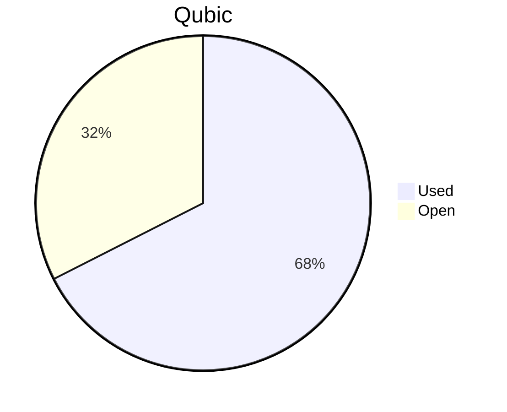

# Financial Reporting August 2025
For August 2025 QCT has spent a total of `19'778'492'909 Qubic`.

For the payments made on the 26.08.2025, `13'800'638'686 Qubic` have been valued at `2603/bln`.<br>
For the payments made on the 02.09.2025, `5'297'345'342 Qubic` have been valued at `2330/bln`.<br>
For the payments made on the 08.09.2025, `680'508'881 Qubic` have been valued at `2083/bln`.<br>

The different exchange rates are because we do not receive all invoices at the same date.

> Total expenses for August were: **49'683.38 $** (paid until 08.09.2025)

## Cost Breakdown

<div style="display: flex; justify-content: center; align-items: center; gap: 10px;flex-wrap:wrap;">
<div>

 ```mermaid
pie title Categories
"Salaries":92.4664774926638
"Infrastructure":7.53352250733624
```


</div>
 <div>

 ```mermaid
pie title Categories
"Core":61.9383469185126
"Integration":20.1624906047676
"Testing":10.3656399693836
"Operation":0
"Overhead":0
```

 </div>
</div>

## Budget View
> Total available budget for April-June 2025: `288'000'000'000 Qubic`.

<div style="display: flex; justify-content: center; align-items: center; gap: 10px;flex-wrap:wrap;">
<div>



 </div>
</div>


## Included Salaries
Because not all developers receive a fixed salary and they send reports on their worked hours, the monthly budget for salaries fluctuate.<br>
The above numbers include the salaries for August of the following persons:

```
icyblob
fnordspace
cyber-pc
raika sternensucher
kavatak
yurabb8
luk
mio
linckode
phil
```

Also, the salary from July is included for linckode due to administrative delays.
```
linckode
```

## Transactions


| Date       | Target Month | Wallet             | Category | $-Qubic/b |   Amount $ |  Amount Qubic | TX Link                                                                                            |
| :--------- | :----------- | :----------------- | :------- | --------: | ---------: | ------------: | :------------------------------------------------------------------------------------------------- |
| 26.08.2025 | August       | QCT-Core           | Salary   |      2603 |  $3'000.00 | 1'152'516'327 | https://explorer.qubic.org/network/tx/esptxzexaoytxdwhweallxyxjntguptyctarpzsjxfmuufvcpisvxyifmaxj |
| 26.08.2025 | August       | QCT-Core           | Salary   |      2603 | $10'932.50 | 4'199'961'583 | https://explorer.qubic.org/network/tx/esptxzexaoytxdwhweallxyxjntguptyctarpzsjxfmuufvcpisvxyifmaxj |
| 26.08.2025 | August       | QCT-Core           | Salary   |      2603 |  $4'000.00 | 1'536'688'436 | https://explorer.qubic.org/network/tx/esptxzexaoytxdwhweallxyxjntguptyctarpzsjxfmuufvcpisvxyifmaxj |
| 26.08.2025 | August       | QCT-Core           | Salary   |      2603 | $12'840.56 | 4'932'985'978 | https://explorer.qubic.org/network/tx/esptxzexaoytxdwhweallxyxjntguptyctarpzsjxfmuufvcpisvxyifmaxj |
| 26.08.2025 | August       | QCT-Testing        | Salary   |      2603 |  $3'150.00 | 1'210'142'144 | https://explorer.qubic.org/network/tx/kutyhktcuisbtdnlqqmigjhvgxiboxkmaglnmozscfawympfvfrldgjhouei |
| 26.08.2025 | August       | QCT-Testing        | Salary   |      2603 |  $2'000.00 |   768'344'218 | https://explorer.qubic.org/network/tx/kutyhktcuisbtdnlqqmigjhvgxiboxkmaglnmozscfawympfvfrldgjhouei |
| 02.09.2025 | August       | QCT-Infrastructure | Server   |      2330 |  $1'038.80 |   445'838'283 | https://explorer.qubic.org/network/tx/ehcsyyknulbxacmjznwlrxprmtjbmovctrtgwljkrbumfkpcztspzswgogcf |
| 02.09.2025 | August       | QCT-Infrastructure | Server   |      2330 |  $1'206.40 |   517'768'240 | https://explorer.qubic.org/network/tx/ehcsyyknulbxacmjznwlrxprmtjbmovctrtgwljkrbumfkpcztspzswgogcf |
| 02.09.2025 | August       | QCT-Infrastructure | Services |      2330 |    $397.71 |   170'688'927 | https://explorer.qubic.org/network/tx/ehcsyyknulbxacmjznwlrxprmtjbmovctrtgwljkrbumfkpcztspzswgogcf |
| 02.09.2025 | August       | QCT-Infrastructure | Services |      2330 |  $1'100.00 |   472'103'004 | https://explorer.qubic.org/network/tx/ehcsyyknulbxacmjznwlrxprmtjbmovctrtgwljkrbumfkpcztspzswgogcf |
| 02.09.2025 | August       | QCT-Integration    | Salary   |      2330 |  $4'830.00 | 2'072'961'373 | https://explorer.qubic.org/network/tx/wsclkkifbmntjepbglsqeueaufdaxowmriolpvmmggxujbuyexttryzeigxb |
| 02.09.2025 | August       | QCT-Integration    | Salary   |      2330 |    $502.41 |   215'625'000 | https://explorer.qubic.org/network/tx/wsclkkifbmntjepbglsqeueaufdaxowmriolpvmmggxujbuyexttryzeigxb |
| 02.09.2025 | August       | QCT-Integration    | Salary   |      2330 |  $2'460.00 | 1'055'793'991 | https://explorer.qubic.org/network/tx/wsclkkifbmntjepbglsqeueaufdaxowmriolpvmmggxujbuyexttryzeigxb |
| 02.09.2025 | August       | QCT-Integration    | Salary   |      2330 |    $807.50 |   346'566'524 | https://explorer.qubic.org/network/tx/wsclkkifbmntjepbglsqeueaufdaxowmriolpvmmggxujbuyexttryzeigxb |
| 08.09.2025 | July         | QCT-Integration    | Salary   |      2083 |  $1'417.50 |   680'508'881 | https://explorer.qubic.org/network/tx/sbqkxxmflfntfcajnywepdfnfwjfzvensaxheuivobtdjvqgsctgjreaymwo |

### Current Balance

> Balance after payments: `93,516,150,173 Qubic`<br>