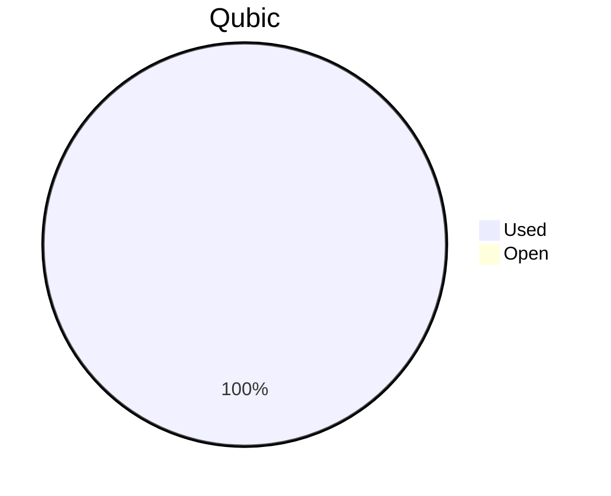
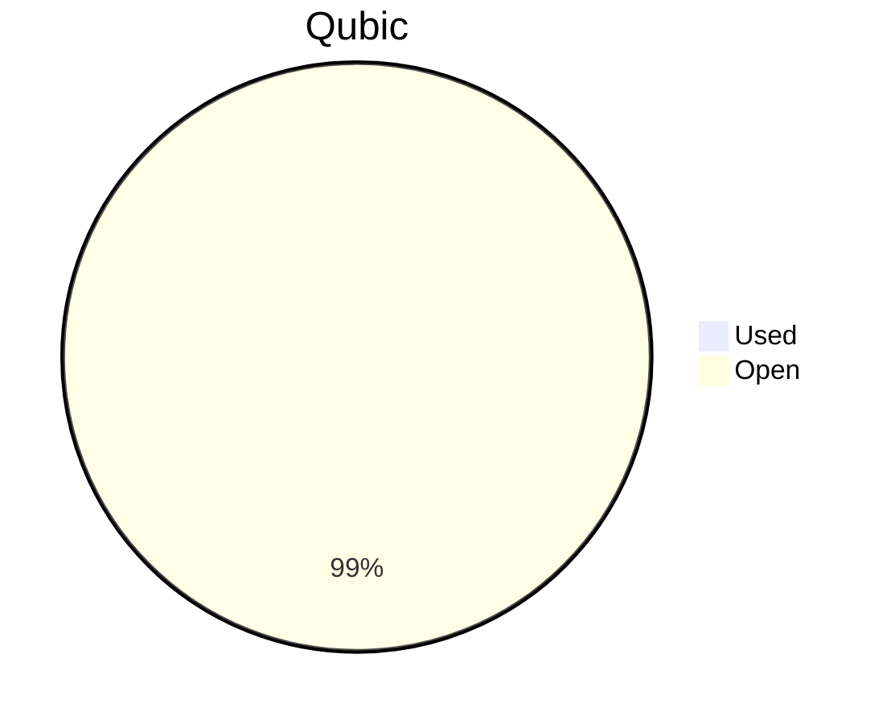

# Financial Reporting October 2025
For October 2025 QCT has spent a total of `59'457'063'128 Qubic`.

For the payments made on the 30.10.2025, `19'295'146'623 Qubic` have been valued at `1347/bln`.<br>
For the payments made on the 05.11.2025, `40'161'916'505 Qubic` have been valued at `1030/bln`.<br>

60 Qubic were spent in the Send to Many Transfers execution fees.<br>
The different exchange rates are because we do not receive all invoices at the same date.

> Total expenses for October were: **67'357.34 $** (paid until 05.11.2025)

## Cost Breakdown

<div style="display: flex; justify-content: center; align-items: center; gap: 10px;flex-wrap:wrap;">
<div>

 ```mermaid
pie title Categories
"Salaries":92.8317039376995
"Infrastructure":7.1682960623005
```

</div>
 <div>

 ```mermaid
pie title Categories
"Core":62.1714877339308
"Integration":23.0144269436782
"Testing":7.64578926009047
"Operation":0
"Overhead":0
```

 </div>
</div>

## Budget View
> Total available budget for April-June 2025: `288'000'000'000 Qubic`.

<div style="display: flex; justify-content: center; align-items: center; gap: 10px;flex-wrap:wrap;">
<div>



 </div>
</div>

> Total available budget for October 2025 - April 2026: `646'000'000'000 Qubic`.

<div style="display: flex; justify-content: center; align-items: center; gap: 10px;flex-wrap:wrap;">
<div>



 </div>
</div>

> **Note:** October 2025 marked a budget transition period. The payments made on October 30th used the remaining funds from the previous funding allocation (April-June 2025). On November 5th, the final portion of the old budget was fully consumed, and the remaining October payments were completed using the new budget injection of `646'000'000'000 Qubic`, approved for a 6-month period through April 2026.

## Included Salaries
Because not all team members receive a fixed salary and they send reports on their worked hours, the monthly budget for salaries fluctuate.<br>
The above numbers include the salaries for October of the following persons:

```
icyblob
cyber-pc
raika sternensucher
feiyu.IV
kavatak
yurabb8
linckode
luk
mio
fnordspace
phil
```

## Transactions


| Date       | Target Month | Wallet             | Category | $-Qubic/b |   Amount $ |  Amount Qubic | TX Link                                                                                            |
| :--------- | :----------- | :----------------- | :------- | --------: | ---------: | ------------: | :------------------------------------------------------------------------------------------------- |
| 30.10.2025 | October      | QCT-Core           | Salary   |      1347 |  $1'500.00 | 1'113'585'746 | https://explorer.qubic.org/network/tx/mpwgsutyofgvndlkzxwsxvkqpxhhrttcnjvniyriwctvsnwthwmwlnxcvtjl |
| 30.10.2025 | October      | QCT-Core           | Salary   |      1347 |  $4'000.00 | 2'969'561'990 | https://explorer.qubic.org/network/tx/mpwgsutyofgvndlkzxwsxvkqpxhhrttcnjvniyriwctvsnwthwmwlnxcvtjl |
| 30.10.2025 | October      | QCT-Core           | Salary   |      1347 | $12'840.56 | 9'532'711'581 | https://explorer.qubic.org/network/tx/mpwgsutyofgvndlkzxwsxvkqpxhhrttcnjvniyriwctvsnwthwmwlnxcvtjl |
| 30.10.2025 | October      | QCT-Core           | Salary   |      1347 |  $2'500.00 | 1'855'976'244 | https://explorer.qubic.org/network/tx/mpwgsutyofgvndlkzxwsxvkqpxhhrttcnjvniyriwctvsnwthwmwlnxcvtjl |
| 30.10.2025 | October      | QCT-Testing        | Salary   |      1347 |  $3'150.00 | 2'338'530'067 | https://explorer.qubic.org/network/tx/ufldgevumtpbafrvuyjxdkfzjhxdxyqpxzqmamxanazbdxgpabbkjtxfjszg |
| 30.10.2025 | October      | QCT-Testing        | Salary   |      1347 |  $2'000.00 | 1'484'780'995 | https://explorer.qubic.org/network/tx/ufldgevumtpbafrvuyjxdkfzjhxdxyqpxzqmamxanazbdxgpabbkjtxfjszg |
| 05.11.2025 | October      | QCT-Integration    | Salary   |      1030 |  $2'037.53 | 1'978'184'466 | https://explorer.qubic.org/network/tx/hqbbarsiiuhcdguyahpwbsfqqareyykzeyasiemlfbkheyegoqznozvehiel |
| 05.11.2025 | October      | QCT-Integration    | Salary   |      1030 |  $1'400.00 | 1'359'223'301 | https://explorer.qubic.org/network/tx/hqbbarsiiuhcdguyahpwbsfqqareyykzeyasiemlfbkheyegoqznozvehiel |
| 05.11.2025 | October      | QCT-Integration    | Salary   |      1030 |     $64.38 |    62'500'000 | https://explorer.qubic.org/network/tx/hqbbarsiiuhcdguyahpwbsfqqareyykzeyasiemlfbkheyegoqznozvehiel |
| 05.11.2025 | October      | QCT-Integration    | Salary   |      1030 | $12'000.00 |11'650'485'437 | https://explorer.qubic.org/network/tx/hqbbarsiiuhcdguyahpwbsfqqareyykzeyasiemlfbkheyegoqznozvehiel |
| 05.11.2025 | October      | QCT-Core           | Salary   |      1030 |  $6'949.00 | 6'746'597'767 | https://explorer.qubic.org/network/tx/hqbbarsiiuhcdguyahpwbsfqqareyykzeyasiemlfbkheyegoqznozvehiel |
| 05.11.2025 | October      | QCT-Core           | Salary   |      1030 | $14'087.50 |13'677'184'466 | https://explorer.qubic.org/network/tx/hqbbarsiiuhcdguyahpwbsfqqareyykzeyasiemlfbkheyegoqznozvehiel |
| 05.11.2025 | October      | QCT-Infrastructure | Server   |      1030 |  $1'018.77 |   989'100'485 | https://explorer.qubic.org/network/tx/hqbbarsiiuhcdguyahpwbsfqqareyykzeyasiemlfbkheyegoqznozvehiel |
| 05.11.2025 | October      | QCT-Infrastructure | Server   |      1030 |  $1'196.00 | 1'161'165'049 | https://explorer.qubic.org/network/tx/hqbbarsiiuhcdguyahpwbsfqqareyykzeyasiemlfbkheyegoqznozvehiel |
| 05.11.2025 | October      | QCT-Infrastructure | Services |      1030 |    $413.60 |   401'553'204 | https://explorer.qubic.org/network/tx/hqbbarsiiuhcdguyahpwbsfqqareyykzeyasiemlfbkheyegoqznozvehiel |
| 05.11.2025 | September    | QCT-Infrastructure | Services |      1030 |  $1'100.00 | 1'067'961'165 | https://explorer.qubic.org/network/tx/hqbbarsiiuhcdguyahpwbsfqqareyykzeyasiemlfbkheyegoqznozvehiel |
| 05.11.2025 | October      | QCT-Infrastructure | Services |      1030 |  $1'100.00 | 1'067'961'165 | https://explorer.qubic.org/network/tx/hqbbarsiiuhcdguyahpwbsfqqareyykzeyasiemlfbkheyegoqznozvehiel |

### Current Balance

> Balance after payments: `642'118'370'147 Qubic`<br>