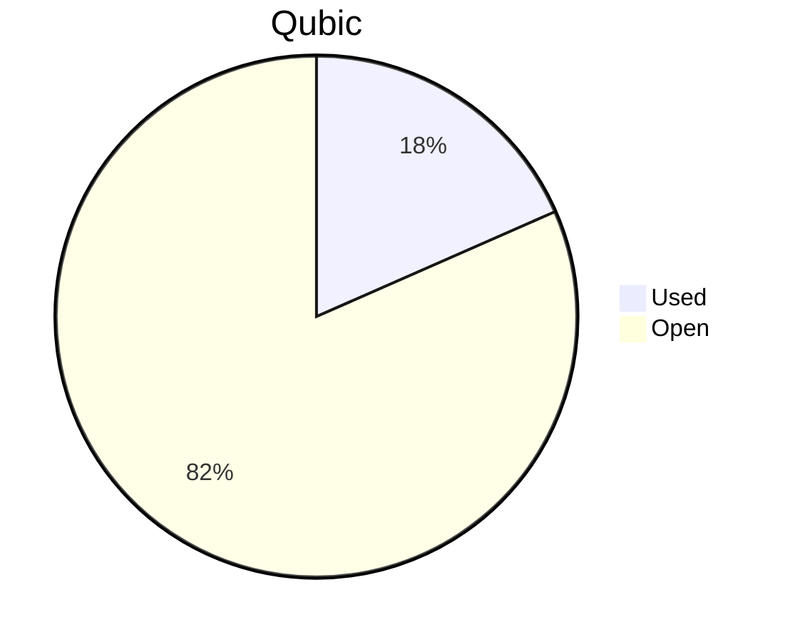

# Financial Reporting November 2025
For November 2025 QCT has spent a total of `115'051'587'668 Qubic`.

For the payments made on the 05.12.2025, `111'551'587'668 Qubic` have been valued at `774/bln`.<br>
For the payments made on the 07.12.2025, `3'500'000'000 Qubic` have been valued at `750/bln`.<br>

50 Qubic were spent in the Send to Many Transfers execution fees.<br>

> Total expenses for November were: **88'965.93 $** (paid until 07.12.2025)

## Cost Breakdown

<div style="display: flex; justify-content: center; align-items: center; gap: 10px;flex-wrap:wrap;">
<div>

 ```mermaid
pie title Categories
"Salaries":91.8551583812174
"Infrastructure":6.45880290790947
"Community-Contribution":1.68603871087312
```

</div>
 <div>

 ```mermaid
pie title Categories
"Core":53.3659306056894
"Integration":20.2433394801626
"Testing":5.78873290733105
"Operation":0
"Overhead":12.4571553880343
"Infrastructure":6.45880290790947
"Client":1.68603571087778
```

 </div>
</div>

## Budget View
> Total available budget for October 2025 - April 2026: `646'000'000'000 Qubic`.

<div style="display: flex; justify-content: center; align-items: center; gap: 10px;flex-wrap:wrap;">
<div>



 </div>
</div>

## Included Salaries
Because not all team members receive a fixed salary and they send reports on their worked hours, the monthly budget for salaries fluctuate.<br>
The above numbers include the salaries for November 2025 of the following persons:

```
cyber-pc
dkat
feiyu.IV
fnordspace
kavatak
keta
linckode
luk
mio
phil
raika sternensucher
sally
yurabb8
```

## Transactions


|    # | Date       | Target Month | Wallet             | Category               | $-Qubic/b |   Amount $ |   Amount Qubic | TX Link                                                                                            |
| ---: | :--------- | :----------- | :----------------- | :--------------------- | --------: | ---------: | -------------: | :------------------------------------------------------------------------------------------------- |
|    1 | 05.12.2025 | November     | QCT-Testing        | Salary                 |       774 |  $3'150.00 |  4'069'767'442 | https://explorer.qubic.org/network/tx/muprauuzqlvjubchueprjusftzocarcbcxvddxelfdzawtszdkvzskacmkzk |
|    2 | 05.12.2025 | November     | QCT-Testing        | Salary                 |       774 |  $2'000.00 |  2'583'979'328 | https://explorer.qubic.org/network/tx/muprauuzqlvjubchueprjusftzocarcbcxvddxelfdzawtszdkvzskacmkzk |
|    3 | 05.12.2025 | November     | QCT-Integration    | Salary                 |       774 |  $1'085.20 |  1'402'067'183 | https://explorer.qubic.org/network/tx/muprauuzqlvjubchueprjusftzocarcbcxvddxelfdzawtszdkvzskacmkzk |
|    4 | 05.12.2025 | November     | QCT-Integration    | Salary                 |       774 |  $4'760.00 |  6'149'870'801 | https://explorer.qubic.org/network/tx/muprauuzqlvjubchueprjusftzocarcbcxvddxelfdzawtszdkvzskacmkzk |
|    5 | 05.12.2025 | November     | QCT-Integration    | Salary                 |       774 |    $164.48 |   212'500'000* | https://explorer.qubic.org/network/tx/muprauuzqlvjubchueprjusftzocarcbcxvddxelfdzawtszdkvzskacmkzk |
|    6 | 05.12.2025 | November     | QCT-Integration    | Salary                 |       774 | $12'000.00 | 15'503'875'969 | https://explorer.qubic.org/network/tx/muprauuzqlvjubchueprjusftzocarcbcxvddxelfdzawtszdkvzskacmkzk |
|    7 | 05.12.2025 | November     | QCT-Core           | Salary                 |       774 |  $4'000.00 |  5'167'958'656 | https://explorer.qubic.org/network/tx/muprauuzqlvjubchueprjusftzocarcbcxvddxelfdzawtszdkvzskacmkzk |
|    8 | 05.12.2025 | November     | QCT-Core           | Salary                 |       774 | $13'167.72 | 17'012'556'486 | https://explorer.qubic.org/network/tx/muprauuzqlvjubchueprjusftzocarcbcxvddxelfdzawtszdkvzskacmkzk |
|    9 | 05.12.2025 | November     | QCT-Core           | Salary                 |       774 |  $5'000.00 |  6'459'948'320 | https://explorer.qubic.org/network/tx/muprauuzqlvjubchueprjusftzocarcbcxvddxelfdzawtszdkvzskacmkzk |
|   10 | 05.12.2025 | November     | QCT-Core           | Salary                 |       774 | $11'208.78 | 14'481'624'207 | https://explorer.qubic.org/network/tx/muprauuzqlvjubchueprjusftzocarcbcxvddxelfdzawtszdkvzskacmkzk |
|   11 | 05.12.2025 | November     | QCT-Core           | Salary                 |       774 |  $9'976.00 | 12'888'888'889 | https://explorer.qubic.org/network/tx/muprauuzqlvjubchueprjusftzocarcbcxvddxelfdzawtszdkvzskacmkzk |
|   12 | 05.12.2025 | November     | QCT-Core           | Community-Contribution |       774 |  $1'500.00 |  1'937'984'496 | https://explorer.qubic.org/network/tx/muprauuzqlvjubchueprjusftzocarcbcxvddxelfdzawtszdkvzskacmkzk |
|   13 | 05.12.2025 | November     | QCT-Infrastructure | Server                 |       774 |  $1'027.63 |  1'327'690'439 | https://explorer.qubic.org/network/tx/muprauuzqlvjubchueprjusftzocarcbcxvddxelfdzawtszdkvzskacmkzk |
|   14 | 05.12.2025 | November     | QCT-Infrastructure | Server                 |       774 |  $1'206.40 |  1'558'656'331 | https://explorer.qubic.org/network/tx/muprauuzqlvjubchueprjusftzocarcbcxvddxelfdzawtszdkvzskacmkzk |
|   15 | 05.12.2025 | November     | QCT-Infrastructure | Services               |       774 |    $412.10 |    532'431'008 | https://explorer.qubic.org/network/tx/muprauuzqlvjubchueprjusftzocarcbcxvddxelfdzawtszdkvzskacmkzk |
|   16 | 05.12.2025 | November     | QCT-Infrastructure | Services               |       774 |  $1'100.00 |  1'421'188'630 | https://explorer.qubic.org/network/tx/muprauuzqlvjubchueprjusftzocarcbcxvddxelfdzawtszdkvzskacmkzk |
|   17 | 05.12.2025 | November     | QCT-Infrastructure | Services               |       774 |  $2'000.00 |  2'583'979'328 | https://explorer.qubic.org/network/tx/muprauuzqlvjubchueprjusftzocarcbcxvddxelfdzawtszdkvzskacmkzk |
|   18 | 05.12.2025 | November     | QCT-Overhead       | Salary                 |       774 | $11'082.62 | 14'318'635'659 | https://explorer.qubic.org/network/tx/muprauuzqlvjubchueprjusftzocarcbcxvddxelfdzawtszdkvzskacmkzk |
|   19 | 05.12.2025 | November     | QCT-Client         | Salary                 |       774 |  $1'500.00 |  1'937'984'496 | https://explorer.qubic.org/network/tx/muprauuzqlvjubchueprjusftzocarcbcxvddxelfdzawtszdkvzskacmkzk |
|   20 | 07.12.2025 | November     | QCT-Core           | Salary                 |       750 |  $2'625.00 | 3'500'000'000* | https://explorer.qubic.org/network/tx/mjnukwycszbfhbivwctzxsbuihlfcqokpbexfflckbjszxeflnnknjmcbpti |

*Transactions #5 and #20: Fixed Qubic amounts agreed in advance; USD values are indicative only.

### Current Balance

> Balance after payments: `527'066'782'429 Qubic`<br>
