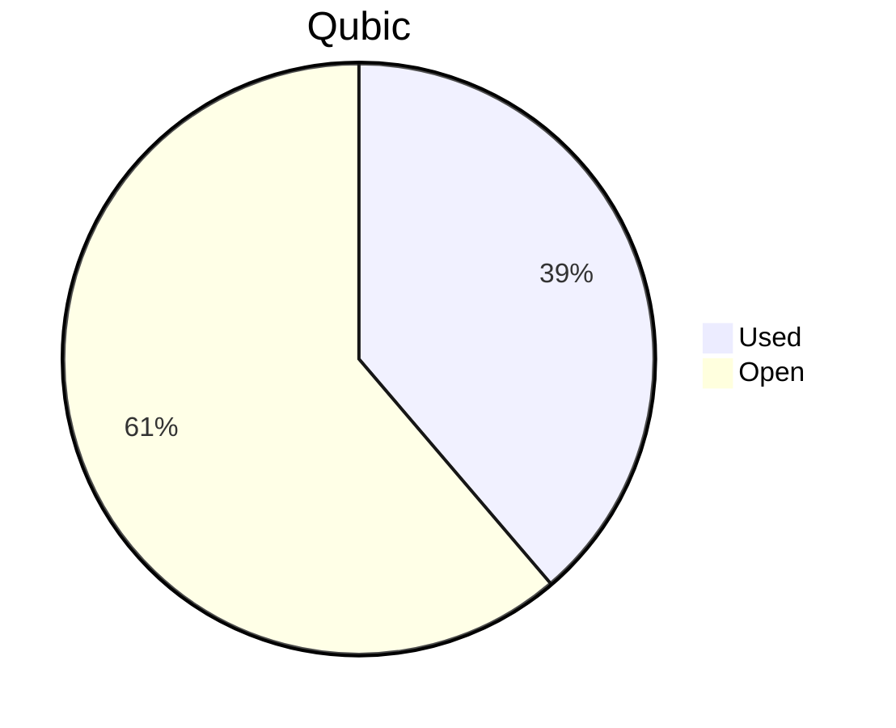

# Financial Reporting December 2025
For December 2025 QCT has spent a total of `131'390'859'404 Qubic`.

For the payments made on the 05.01.2026, `131'390'859'344 Qubic` have been valued at `663/bln`.<br>

60 Qubic were spent in the Send to Many Transfers execution fees.<br>

> Total expenses for December were: **87'112.13 $** (paid until 05.01.2026)

## Cost Breakdown

<div style="display: flex; justify-content: center; align-items: center; gap: 10px;flex-wrap:wrap;">
<div>

 ```mermaid
pie title Categories
"Salaries":89.34
"Infrastructure":6.64
"Community-Contribution":4.02
```

</div>
 <div>

 ```mermaid
pie title Categories
"Core":51.31
"Integration":16.89
"Testing":5.91
"Operation":0
"Overhead":12.93
"Infrastructure":6.64
"Client":6.31
```

 </div>
</div>

## Budget View
> Total available budget for October 2025 - April 2026: `646'000'000'000 Qubic`.

<div style="display: flex; justify-content: center; align-items: center; gap: 10px;flex-wrap:wrap;">
<div>



 </div>
</div>

## Included Salaries
Because not all team members receive a fixed salary and they send reports on their worked hours, the monthly budget for salaries fluctuate.<br>
The above numbers include the salaries for December 2025 of the following persons:

```
fnordspace
keta
luk
alez
dkat
raika sternensucher
yurabb8
sally
cyber-pc
mio
kavatak
phil
feiyu.IV
linckode
```

## Transactions


|    # | Date       | Target Month | Wallet             | Category               | $-Qubic/b |   Amount $ |   Amount Qubic | TX Link                                                                                            |
| ---: | :--------- | :----------- | :----------------- | :--------------------- | --------: | ---------: | -------------: | :------------------------------------------------------------------------------------------------- |
|    1 | 05.01.2026 | December     | QCT-Testing        | Salary                 |       663 |  $3'150.00 |  4'751'131'222 | https://explorer.qubic.org/network/tx/btjalmyluqgleekgfzjujgqtxwsgxuznpgvrvdivkciblvntgeheuwtcvaqn |
|    2 | 05.01.2026 | December     | QCT-Testing        | Salary                 |       663 |  $2'000.00 |  3'016'591'252 | https://explorer.qubic.org/network/tx/btjalmyluqgleekgfzjujgqtxwsgxuznpgvrvdivkciblvntgeheuwtcvaqn |
|    3 | 05.01.2026 | December     | QCT-Integration    | Salary                 |       663 |  $1'109.94 |  1'674'117'647 | https://explorer.qubic.org/network/tx/btjalmyluqgleekgfzjujgqtxwsgxuznpgvrvdivkciblvntgeheuwtcvaqn |
|    4 | 05.01.2026 | December     | QCT-Integration    | Salary                 |       663 |  $4'200.00 |  6'334'841'629 | https://explorer.qubic.org/network/tx/btjalmyluqgleekgfzjujgqtxwsgxuznpgvrvdivkciblvntgeheuwtcvaqn |
|    5 | 05.01.2026 | December     | QCT-Integration    | Salary                 |       663 |    $124.31 |   187'500'000* | https://explorer.qubic.org/network/tx/btjalmyluqgleekgfzjujgqtxwsgxuznpgvrvdivkciblvntgeheuwtcvaqn |
|    6 | 05.01.2026 | December     | QCT-Integration    | Salary                 |       663 |  $9'280.00 | 13'996'983'409 | https://explorer.qubic.org/network/tx/btjalmyluqgleekgfzjujgqtxwsgxuznpgvrvdivkciblvntgeheuwtcvaqn |
|    7 | 05.01.2026 | December     | QCT-Core           | Salary                 |       663 |  $4'000.00 |  6'033'182'504 | https://explorer.qubic.org/network/tx/btjalmyluqgleekgfzjujgqtxwsgxuznpgvrvdivkciblvntgeheuwtcvaqn |
|    8 | 05.01.2026 | December     | QCT-Core           | Salary                 |       663 | $13'380.10 | 20'181'148'235 | https://explorer.qubic.org/network/tx/btjalmyluqgleekgfzjujgqtxwsgxuznpgvrvdivkciblvntgeheuwtcvaqn |
|    9 | 05.01.2026 | December     | QCT-Core           | Salary                 |       663 |  $5'000.00 |  7'541'478'130 | https://explorer.qubic.org/network/tx/btjalmyluqgleekgfzjujgqtxwsgxuznpgvrvdivkciblvntgeheuwtcvaqn |
|   10 | 05.01.2026 | December     | QCT-Core           | Salary                 |       663 | $11'389.56 | 17'178'829'357 | https://explorer.qubic.org/network/tx/btjalmyluqgleekgfzjujgqtxwsgxuznpgvrvdivkciblvntgeheuwtcvaqn |
|   11 | 05.01.2026 | December     | QCT-Core           | Salary                 |       663 |  $7'107.75 | 10'720'588'235 | https://explorer.qubic.org/network/tx/btjalmyluqgleekgfzjujgqtxwsgxuznpgvrvdivkciblvntgeheuwtcvaqn |
|   12 | 05.01.2026 | December     | QCT-Core           | Community-Contribution |       663 |  $1'500.00 |  2'262'443'439 | https://explorer.qubic.org/network/tx/btjalmyluqgleekgfzjujgqtxwsgxuznpgvrvdivkciblvntgeheuwtcvaqn |
|   13 | 05.01.2026 | December     | QCT-Core           | Salary                 |       663 |  $2'320.50 | 3'500'000'000* | https://explorer.qubic.org/network/tx/btjalmyluqgleekgfzjujgqtxwsgxuznpgvrvdivkciblvntgeheuwtcvaqn |
|   14 | 05.01.2026 | December     | QCT-Infrastructure | Server                 |       663 |  $1'059.91 |  1'598'664'706 | https://explorer.qubic.org/network/tx/btjalmyluqgleekgfzjujgqtxwsgxuznpgvrvdivkciblvntgeheuwtcvaqn |
|   15 | 05.01.2026 | December     | QCT-Infrastructure | Server                 |       663 |  $1'216.80 |  1'835'294'118 | https://explorer.qubic.org/network/tx/btjalmyluqgleekgfzjujgqtxwsgxuznpgvrvdivkciblvntgeheuwtcvaqn |
|   16 | 05.01.2026 | December     | QCT-Infrastructure | Services               |       663 |    $411.88 |    621'238'914 | https://explorer.qubic.org/network/tx/btjalmyluqgleekgfzjujgqtxwsgxuznpgvrvdivkciblvntgeheuwtcvaqn |
|   17 | 05.01.2026 | December     | QCT-Infrastructure | Services               |       663 |  $1'100.00 |  1'659'125'189 | https://explorer.qubic.org/network/tx/btjalmyluqgleekgfzjujgqtxwsgxuznpgvrvdivkciblvntgeheuwtcvaqn |
|   18 | 05.01.2026 | December     | QCT-Infrastructure | Services               |       663 |  $2'000.00 |  3'016'591'252 | https://explorer.qubic.org/network/tx/btjalmyluqgleekgfzjujgqtxwsgxuznpgvrvdivkciblvntgeheuwtcvaqn |
|   19 | 05.01.2026 | December     | QCT-Overhead       | Salary                 |       663 | $11'261.38 | 16'985'484'163 | https://explorer.qubic.org/network/tx/btjalmyluqgleekgfzjujgqtxwsgxuznpgvrvdivkciblvntgeheuwtcvaqn |
|   20 | 05.01.2026 | December     | QCT-Client         | Salary                 |       663 |  $1'500.00 |  2'262'443'439 | https://explorer.qubic.org/network/tx/btjalmyluqgleekgfzjujgqtxwsgxuznpgvrvdivkciblvntgeheuwtcvaqn |
|   21 | 05.01.2026 | December     | QCT-Client         | Salary                 |       663 |  $2'000.00 |  3'016'591'252 | https://explorer.qubic.org/network/tx/btjalmyluqgleekgfzjujgqtxwsgxuznpgvrvdivkciblvntgeheuwtcvaqn |
|   22 | 05.01.2026 | December     | QCT-Client         | Community-Contribution |       663 |  $2'000.00 |  3'016'591'252 | https://explorer.qubic.org/network/tx/btjalmyluqgleekgfzjujgqtxwsgxuznpgvrvdivkciblvntgeheuwtcvaqn |

*Transactions #5 and #13: Fixed Qubic amounts agreed in advance; USD values are indicative only.

### Current Balance

> Balance after payments: `395'675'923'025 Qubic`<br>
