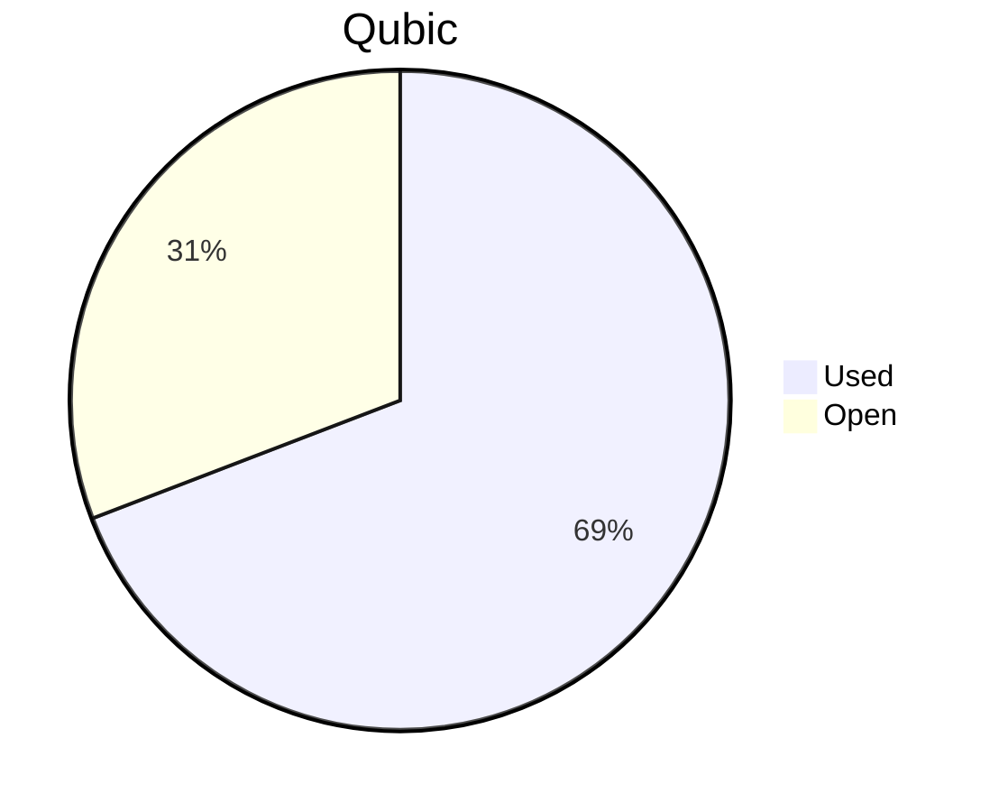

# Financial Reporting January 2026
For January 2026 QCT has spent a total of `196'565'691'269 Qubic`.

For the payments made on the 05.02.2026, `196'565'691'199 Qubic` have been valued at `531/bln`.<br>

70 Qubic were spent in the Send to Many Transfers execution fees.<br>

> Total expenses for January were: **104'376.38 $** (paid until 05.02.2026)

## Cost Breakdown

<div style="display: flex; justify-content: center; align-items: center; gap: 10px;flex-wrap:wrap;">
<div>

 ```mermaid
pie title Categories
"Salaries":94.4224137807825
"Infrastructure":5.57758621921751
```

</div>
 <div>

 ```mermaid
pie title Categories
"Core":48.8308926662202
"Integration":15.7193379685387
"Testing":4.93406640471323
"Operation":0
"Overhead":21.5848677283985
"Infrastructure":5.57758621921751
"Client":3.35325501291189
```

 </div>
</div>

## Budget View
> Total available budget for October 2025 - April 2026: `646'000'000'000 Qubic`.

<div style="display: flex; justify-content: center; align-items: center; gap: 10px;flex-wrap:wrap;">
<div>



 </div>
</div>

## Included Salaries
Because not all team members receive a fixed salary and they send reports on their worked hours, the monthly budget for salaries fluctuate.<br>
The above numbers include the salaries for January 2026 of the following persons (alphabetical order):

```
alez
cyber-pc
dkat
feiyu.IV
fnordspace
kavatak
keta
kimz300
linckode
luk
mio
Mr.Rose
phil
raika sternensucher
sally
yurabb8
```

## Transactions


|    # | Date       | Target Month | Wallet             | Category               | $-Qubic/b |   Amount $ |   Amount Qubic | TX Link                                                                                            |
| ---: | :--------- | :----------- | :----------------- | :--------------------- | --------: | ---------: | -------------: | :------------------------------------------------------------------------------------------------- |
|    1 | 05.02.2026 | January      | QCT-Testing        | Salary                 |       531 |  $3'150.00 |  5'932'203'390 | https://explorer.qubic.org/network/tx/eueyqcvgtfbaigniekmrmkpmroyeuefvekovwusfzafaqgoxmwrkxrndunwg |
|    2 | 05.02.2026 | January      | QCT-Testing        | Salary                 |       531 |  $2'000.00 |  3'766'478'343 | https://explorer.qubic.org/network/tx/eueyqcvgtfbaigniekmrmkpmroyeuefvekovwusfzafaqgoxmwrkxrndunwg |
|    3 | 05.02.2026 | January      | QCT-Integration    | Salary                 |       531 |  $2'164.72 |  4'076'685'499 | https://explorer.qubic.org/network/tx/eueyqcvgtfbaigniekmrmkpmroyeuefvekovwusfzafaqgoxmwrkxrndunwg |
|    4 | 05.02.2026 | January      | QCT-Integration    | Salary                 |       531 |  $4'900.00 |  9'227'871'940 | https://explorer.qubic.org/network/tx/eueyqcvgtfbaigniekmrmkpmroyeuefvekovwusfzafaqgoxmwrkxrndunwg |
|    5 | 05.02.2026 | January      | QCT-Integration    | Salary                 |       531 |    $116.16 |    218'750'000* | https://explorer.qubic.org/network/tx/eueyqcvgtfbaigniekmrmkpmroyeuefvekovwusfzafaqgoxmwrkxrndunwg |
|    6 | 05.02.2026 | January      | QCT-Integration    | Salary                 |       531 |  $9'226.40 | 17'375'517'891 | https://explorer.qubic.org/network/tx/eueyqcvgtfbaigniekmrmkpmroyeuefvekovwusfzafaqgoxmwrkxrndunwg |
|    7 | 05.02.2026 | January      | QCT-Core           | Salary                 |       531 |  $4'000.00 |  7'532'956'685 | https://explorer.qubic.org/network/tx/eueyqcvgtfbaigniekmrmkpmroyeuefvekovwusfzafaqgoxmwrkxrndunwg |
|    8 | 05.02.2026 | January      | QCT-Core           | Salary                 |       531 | $13'698.68 | 25'797'881'582 | https://explorer.qubic.org/network/tx/eueyqcvgtfbaigniekmrmkpmroyeuefvekovwusfzafaqgoxmwrkxrndunwg |
|    9 | 05.02.2026 | January      | QCT-Core           | Salary                 |       531 |  $5'000.00 |  9'416'195'857 | https://explorer.qubic.org/network/tx/eueyqcvgtfbaigniekmrmkpmroyeuefvekovwusfzafaqgoxmwrkxrndunwg |
|   10 | 05.02.2026 | January      | QCT-Core           | Salary                 |       531 | $11'660.74 | 21'959'969'785 | https://explorer.qubic.org/network/tx/eueyqcvgtfbaigniekmrmkpmroyeuefvekovwusfzafaqgoxmwrkxrndunwg |
|   11 | 05.02.2026 | January      | QCT-Core           | Salary                 |       531 | $14'750.00 | 27'777'777'778 | https://explorer.qubic.org/network/tx/eueyqcvgtfbaigniekmrmkpmroyeuefvekovwusfzafaqgoxmwrkxrndunwg |
|   12 | 05.02.2026 | January      | QCT-Core           | Salary                 |       531 |  $1'858.50 |  3'500'000'000* | https://explorer.qubic.org/network/tx/eueyqcvgtfbaigniekmrmkpmroyeuefvekovwusfzafaqgoxmwrkxrndunwg |
|   13 | 05.02.2026 | January      | QCT-Infrastructure | Server                 |       531 |  $1'081.54 |  2'036'800'000 | https://explorer.qubic.org/network/tx/eueyqcvgtfbaigniekmrmkpmroyeuefvekovwusfzafaqgoxmwrkxrndunwg |
|   14 | 05.02.2026 | January      | QCT-Infrastructure | Server                 |       531 |  $1'227.20 |  2'311'111'111 | https://explorer.qubic.org/network/tx/eueyqcvgtfbaigniekmrmkpmroyeuefvekovwusfzafaqgoxmwrkxrndunwg |
|   15 | 05.02.2026 | January      | QCT-Infrastructure | Services               |       531 |    $412.94 |    777'668'362 | https://explorer.qubic.org/network/tx/eueyqcvgtfbaigniekmrmkpmroyeuefvekovwusfzafaqgoxmwrkxrndunwg |
|   16 | 05.02.2026 | January      | QCT-Infrastructure | Services               |       531 |  $1'100.00 |  2'071'563'089 | https://explorer.qubic.org/network/tx/eueyqcvgtfbaigniekmrmkpmroyeuefvekovwusfzafaqgoxmwrkxrndunwg |
|   17 | 05.02.2026 | January      | QCT-Infrastructure | Services               |       531 |  $2'000.00 |  3'766'478'343 | https://explorer.qubic.org/network/tx/eueyqcvgtfbaigniekmrmkpmroyeuefvekovwusfzafaqgoxmwrkxrndunwg |
|   18 | 05.02.2026 | January      | QCT-Overhead       | Salary                 |       531 | $11'529.50 | 21'712'813'559 | https://explorer.qubic.org/network/tx/eueyqcvgtfbaigniekmrmkpmroyeuefvekovwusfzafaqgoxmwrkxrndunwg |
|   19 | 05.02.2026 | January      | QCT-Overhead       | Salary                 |       531 |  $6'000.00 | 11'299'435'028 | https://explorer.qubic.org/network/tx/eueyqcvgtfbaigniekmrmkpmroyeuefvekovwusfzafaqgoxmwrkxrndunwg |
|   20 | 05.02.2026 | January      | QCT-Overhead       | Salary                 |       531 |  $5'000.00 |  9'416'195'857 | https://explorer.qubic.org/network/tx/eueyqcvgtfbaigniekmrmkpmroyeuefvekovwusfzafaqgoxmwrkxrndunwg |
|   21 | 05.02.2026 | January      | QCT-Client         | Salary                 |       531 |  $1'500.00 |  2'824'858'757 | https://explorer.qubic.org/network/tx/eueyqcvgtfbaigniekmrmkpmroyeuefvekovwusfzafaqgoxmwrkxrndunwg |
|   22 | 05.02.2026 | January      | QCT-Client         | Salary                 |       531 |  $2'000.00 |  3'766'478'343 | https://explorer.qubic.org/network/tx/eueyqcvgtfbaigniekmrmkpmroyeuefvekovwusfzafaqgoxmwrkxrndunwg |

*Transactions #5 and #12: Fixed Qubic amounts agreed in advance; USD values are indicative only.

### Current Balance

> Balance after payments: `199'110'231'756 Qubic`<br>
