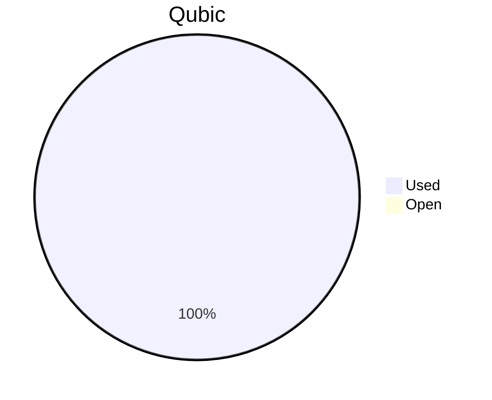

# Financial Reporting February 2026
For February 2026 a total of `212'661'896'584 Qubic` have been paid out.

For the payments made on the 05.03.2026, `212'661'896'524 Qubic` have been valued at `494/bln`.<br>

60 Qubic were spent in the Send to Many Transfers execution fees.<br>

> The QCT treasury balance of `199'110'231'756 Qubic` was insufficient to cover the full February expenses. The shortfall of `13'551'664'828 Qubic` was covered by J0ET0M from personal funds. The budget received in the last proposal was initially expected to last until April. Due to the lower valuation of Qubic, a new budget proposal for covering costs since March is expected.

> Total expenses for February were: **105'054.97 $** (paid until 05.03.2026)

## Cost Breakdown

<div style="display: flex; justify-content: center; align-items: center; gap: 10px;flex-wrap:wrap;">
<div>

 ```mermaid
pie title Categories
"Salaries":94.3589981399393
"Infrastructure":5.64100186006074
```

</div>
 <div>

 ```mermaid
pie title Categories
"Core":48.9932375976933
"Integration":18.1513164020954
"Testing":4.90219516756887
"Operation":0
"Overhead":18.9806600237485
"Infrastructure":5.64100186006074
"Client":3.33159096883329
```

 </div>
</div>

## Budget View
> Total available budget for October 2025 - April 2026: `646'000'000'000 Qubic`.

<div style="display: flex; justify-content: center; align-items: center; gap: 10px;flex-wrap:wrap;">
<div>



 </div>
</div>

## Included Salaries
Because not all team members receive a fixed salary and they send reports on their worked hours, the monthly budget for salaries fluctuate.<br>
The above numbers include the salaries for February 2026 of the following persons (alphabetical order):

```
alez
cyber-pc
dkat
feiyu.IV
fnordspace
kavatak
keta
kimz300
linckode
luk
mio
Mr.Rose
phil
raika sternensucher
sally
yurabb8
```

## Transactions


|    # | Date       | Target Month | Wallet             | Category               | $-Qubic/b |   Amount $ |   Amount Qubic | TX Link                                                                                            |
| ---: | :--------- | :----------- | :----------------- | :--------------------- | --------: | ---------: | -------------: | :------------------------------------------------------------------------------------------------- |
|    1 | 05.03.2026 | February     | QCT-Testing        | Salary                 |       494 |  $3'150.00 |  6'376'518'219 | https://explorer.qubic.org/network/tx/ipebkstjmfiwqfylwfsirpmcqcbhjxpxphwuwobjpesswuldcbfdlbsddtpi |
|    2 | 05.03.2026 | February     | QCT-Testing        | Salary                 |       494 |  $2'000.00 |  4'048'582'996 | https://explorer.qubic.org/network/tx/ipebkstjmfiwqfylwfsirpmcqcbhjxpxphwuwobjpesswuldcbfdlbsddtpi |
|    3 | 05.03.2026 | February     | QCT-Integration    | Salary                 |       494 |  $8'050.00 | 16'295'546'559 | https://explorer.qubic.org/network/tx/ipebkstjmfiwqfylwfsirpmcqcbhjxpxphwuwobjpesswuldcbfdlbsddtpi |
|    4 | 05.03.2026 | February     | QCT-Integration    | Salary                 |       494 |    $177.53 |    359'375'000* | https://explorer.qubic.org/network/tx/ipebkstjmfiwqfylwfsirpmcqcbhjxpxphwuwobjpesswuldcbfdlbsddtpi |
|    5 | 05.03.2026 | February     | QCT-Integration    | Salary                 |       494 |  $1'961.33 |  3'970'303'644 | https://explorer.qubic.org/network/tx/ipebkstjmfiwqfylwfsirpmcqcbhjxpxphwuwobjpesswuldcbfdlbsddtpi |
|    6 | 05.03.2026 | February     | QCT-Integration    | Salary                 |       494 |  $8'880.00 | 17'975'708'502 | https://explorer.qubic.org/network/tx/ipebkstjmfiwqfylwfsirpmcqcbhjxpxphwuwobjpesswuldcbfdlbsddtpi |
|    7 | 05.03.2026 | February     | QCT-Core           | Salary                 |       494 |  $4'000.00 |  8'097'165'992 | https://explorer.qubic.org/network/tx/kmhhudqvlapstdjurmbfsdtljlnblvwmzfgiivfrxfvlambnlpayredbegld |
|    8 | 05.03.2026 | February     | QCT-Core           | Salary                 |       494 | $13'592.48 | 27'515'149'474 | https://explorer.qubic.org/network/tx/kmhhudqvlapstdjurmbfsdtljlnblvwmzfgiivfrxfvlambnlpayredbegld |
|    9 | 05.03.2026 | February     | QCT-Core           | Salary                 |       494 |  $5'000.00 | 10'121'457'490 | https://explorer.qubic.org/network/tx/kmhhudqvlapstdjurmbfsdtljlnblvwmzfgiivfrxfvlambnlpayredbegld |
|   10 | 05.03.2026 | February     | QCT-Core           | Salary                 |       494 | $11'570.35 | 23'421'762'332 | https://explorer.qubic.org/network/tx/jbxhntbhzhvukcirjrcbazvdnjngvcgripijtycrddvmfkstwzwkglbhosum |
|   11 | 05.03.2026 | February     | QCT-Core           | Salary                 |       494 | $13'108.00 | 26'534'412'955 | https://explorer.qubic.org/network/tx/jbxhntbhzhvukcirjrcbazvdnjngvcgripijtycrddvmfkstwzwkglbhosum |
|   12 | 05.03.2026 | February     | QCT-Core           | Salary                 |       494 |  $1'729.00 |  3'500'000'000* | https://explorer.qubic.org/network/tx/ipebkstjmfiwqfylwfsirpmcqcbhjxpxphwuwobjpesswuldcbfdlbsddtpi |
|   13 | 05.03.2026 | February     | QCT-Core           | Community-Contribution |       494 |  $2'470.00 |  5'000'000'000* | https://explorer.qubic.org/network/tx/zdbonwlncwlqbbuhrwnfnohsjicfpzhkyywajqsfhffpjvvsjcyyazzguqsb |
|   14 | 05.03.2026 | February     | QCT-Infrastructure | Server                 |       494 |  $1'050.59 |  2'126'697'976 | https://explorer.qubic.org/network/tx/zdbonwlncwlqbbuhrwnfnohsjicfpzhkyywajqsfhffpjvvsjcyyazzguqsb |
|   15 | 05.03.2026 | February     | QCT-Infrastructure | Server                 |       494 |  $1'206.40 |  2'442'105'263 | https://explorer.qubic.org/network/tx/zdbonwlncwlqbbuhrwnfnohsjicfpzhkyywajqsfhffpjvvsjcyyazzguqsb |
|   16 | 05.03.2026 | February     | QCT-Infrastructure | Services               |       494 |    $395.17 |    799'948'178 | https://explorer.qubic.org/network/tx/zdbonwlncwlqbbuhrwnfnohsjicfpzhkyywajqsfhffpjvvsjcyyazzguqsb |
|   17 | 05.03.2026 | February     | QCT-Infrastructure | Services               |       494 |  $1'100.00 |  2'226'720'648 | https://explorer.qubic.org/network/tx/zdbonwlncwlqbbuhrwnfnohsjicfpzhkyywajqsfhffpjvvsjcyyazzguqsb |
|   18 | 05.03.2026 | February     | QCT-Infrastructure | Services               |       494 |  $2'000.00 |  4'048'582'996 | https://explorer.qubic.org/network/tx/zdbonwlncwlqbbuhrwnfnohsjicfpzhkyywajqsfhffpjvvsjcyyazzguqsb |
|   19 | 05.03.2026 | February     | QCT-Infrastructure | Services               |       494 |    $173.99 |    352'206'478 | https://explorer.qubic.org/network/tx/zkijajfamjtflhqqfcggpzsskpddbhnxtluocfbaahjlknhrmwsxiaxbixte |
|   20 | 05.03.2026 | February     | QCT-Overhead       | Salary                 |       494 | $11'440.13 | 23'158'153'846 | https://explorer.qubic.org/network/tx/zkijajfamjtflhqqfcggpzsskpddbhnxtluocfbaahjlknhrmwsxiaxbixte |
|   21 | 05.03.2026 | February     | QCT-Overhead       | Salary                 |       494 |  $6'000.00 | 12'145'748'988 | https://explorer.qubic.org/network/tx/zkijajfamjtflhqqfcggpzsskpddbhnxtluocfbaahjlknhrmwsxiaxbixte |
|   22 | 05.03.2026 | February     | QCT-Overhead       | Salary                 |       494 |  $2'500.00 |  5'060'728'745 | https://explorer.qubic.org/network/tx/zkijajfamjtflhqqfcggpzsskpddbhnxtluocfbaahjlknhrmwsxiaxbixte |
|   23 | 05.03.2026 | February     | QCT-Client         | Salary                 |       494 |  $1'500.00 |  3'036'437'247 | https://explorer.qubic.org/network/tx/fshmoqavnjtjjfbkzokgrflhmlfdusdjwkmlvsysbdrfmwujrhtamzneevcg |
|   24 | 05.03.2026 | February     | QCT-Client         | Salary                 |       494 |  $2'000.00 |  4'048'582'996 | https://explorer.qubic.org/network/tx/fshmoqavnjtjjfbkzokgrflhmlfdusdjwkmlvsysbdrfmwujrhtamzneevcg |

*Transactions #4, #12, and #13: Fixed Qubic amounts agreed in advance; USD values are indicative only.

### Current Balance

> Balance after payments: `0 Qubic`<br>
> Budget for the period October 2025 - April 2026 has been fully used.<br>
