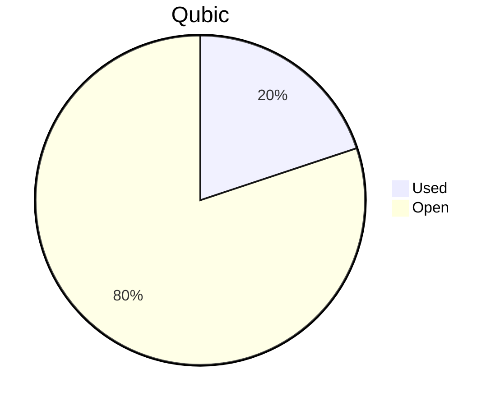

# Financial Reporting March 2026
For March 2026 a total of `113'819'834'508 Qubic` have been paid out.

For the payments made on the 05.04.2026, `113'819'834'438 Qubic` have been valued at `903/bln`.<br>

70 Qubic were spent in the Send to Many Transfers execution fees.<br>

> Total expenses for March were: **102'779.31 $** (paid until 05.04.2026)

## Cost Breakdown

<div style="display: flex; justify-content: center; align-items: center; gap: 10px;flex-wrap:wrap;">
<div>

 ```mermaid
pie title Categories
"Salaries":93.2614265204300
"Infrastructure":6.7385734795600
```

</div>
 <div>

 ```mermaid
pie title Categories
"Core":44.1879553201900
"Integration":21.5173441505500
"Testing":5.0107356226900
"Operation":0
"Overhead":19.1400371203000
"Infrastructure":6.7385734795600
"Client":3.4053543066800
```

 </div>
</div>

## Budget View
> Total available budget for March 2026 - June 2026: `572'000'000'000 Qubic`.

<div style="display: flex; justify-content: center; align-items: center; gap: 10px;flex-wrap:wrap;">
<div>



 </div>
</div>

## Included Salaries
Because not all team members receive a fixed salary and they send reports on their worked hours, the monthly budget for salaries fluctuate.<br>
The above numbers include the salaries for March 2026 of the following persons (alphabetical order):

```
alez
cyber-pc
dkat
feiyu.IV
fnordspace
kavatak
keta
kimz300
linckode
luk
mio
Mr.Rose
phil
raika sternensucher
sally
yurabb8
```

## Transactions


|    # | Date       | Target Month | Wallet             | Category               | $-Qubic/b |   Amount $ |   Amount Qubic | TX Link                                                                                            |
| ---: | :--------- | :----------- | :----------------- | :--------------------- | --------: | ---------: | -------------: | :------------------------------------------------------------------------------------------------- |
|    1 | 05.04.2026 | March        | QCT-Core           | Salary                 |       903 |  $4'000.00 |  4'429'678'848 | https://explorer.qubic.org/network/tx/trhkgrpupfmwjbfqztvfijyhoqpakgwbrrfecvzxbduvetelspokqmkhlfwg |
|    2 | 05.04.2026 | March        | QCT-Core           | Salary                 |       903 | $13'273.91 | 14'699'789'590 | https://explorer.qubic.org/network/tx/trhkgrpupfmwjbfqztvfijyhoqpakgwbrrfecvzxbduvetelspokqmkhlfwg |
|    3 | 05.04.2026 | March        | QCT-Core           | Salary                 |       903 |  $5'000.00 |  5'537'098'560 | https://explorer.qubic.org/network/tx/trhkgrpupfmwjbfqztvfijyhoqpakgwbrrfecvzxbduvetelspokqmkhlfwg |
|    4 | 05.04.2026 | March        | QCT-Core           | Salary                 |       903 | $11'299.17 | 12'512'924'142 | https://explorer.qubic.org/network/tx/trhkgrpupfmwjbfqztvfijyhoqpakgwbrrfecvzxbduvetelspokqmkhlfwg |
|    5 | 05.04.2026 | March        | QCT-Core           | Salary                 |       903 |  $8'682.50 |  9'615'171'650 | https://explorer.qubic.org/network/tx/trhkgrpupfmwjbfqztvfijyhoqpakgwbrrfecvzxbduvetelspokqmkhlfwg |
|    6 | 05.04.2026 | March        | QCT-Core           | Salary                 |       903 |  $3'160.50 |  3'500'000'000* | https://explorer.qubic.org/network/tx/trhkgrpupfmwjbfqztvfijyhoqpakgwbrrfecvzxbduvetelspokqmkhlfwg |
|    7 | 05.04.2026 | March        | QCT-Overhead       | Salary                 |       903 |  $6'000.00 |  6'644'518'272 | https://explorer.qubic.org/network/tx/trhkgrpupfmwjbfqztvfijyhoqpakgwbrrfecvzxbduvetelspokqmkhlfwg |
|    8 | 05.04.2026 | March        | QCT-Overhead       | Salary                 |       903 |  $2'500.00 |  2'768'549'280 | https://explorer.qubic.org/network/tx/trhkgrpupfmwjbfqztvfijyhoqpakgwbrrfecvzxbduvetelspokqmkhlfwg |
|    9 | 05.04.2026 | March        | QCT-Overhead       | Salary                 |       903 | $11'172.00 | 12'372'093'023 | https://explorer.qubic.org/network/tx/trhkgrpupfmwjbfqztvfijyhoqpakgwbrrfecvzxbduvetelspokqmkhlfwg |
|   10 | 05.04.2026 | March        | QCT-Client         | Salary                 |       903 |  $1'500.00 |  1'661'129'568 | https://explorer.qubic.org/network/tx/trhkgrpupfmwjbfqztvfijyhoqpakgwbrrfecvzxbduvetelspokqmkhlfwg |
|   11 | 05.04.2026 | March        | QCT-Client         | Salary                 |       903 |  $2'000.00 |  2'214'839'424 | https://explorer.qubic.org/network/tx/trhkgrpupfmwjbfqztvfijyhoqpakgwbrrfecvzxbduvetelspokqmkhlfwg |
|   12 | 05.04.2026 | March        | QCT-Infrastructure | Server                 |       903 |    $805.81 |    892'364'341 | https://explorer.qubic.org/network/tx/trhkgrpupfmwjbfqztvfijyhoqpakgwbrrfecvzxbduvetelspokqmkhlfwg |
|   13 | 05.04.2026 | March        | QCT-Infrastructure | Server                 |       903 |  $1'196.00 |  1'324'473'976 | https://explorer.qubic.org/network/tx/trhkgrpupfmwjbfqztvfijyhoqpakgwbrrfecvzxbduvetelspokqmkhlfwg |
|   14 | 05.04.2026 | March        | QCT-Infrastructure | Services               |       903 |    $255.20 |    282'613'511 | https://explorer.qubic.org/network/tx/trhkgrpupfmwjbfqztvfijyhoqpakgwbrrfecvzxbduvetelspokqmkhlfwg |
|   15 | 05.04.2026 | March        | QCT-Infrastructure | Services               |       903 |  $1'100.00 |  1'218'161'683 | https://explorer.qubic.org/network/tx/trhkgrpupfmwjbfqztvfijyhoqpakgwbrrfecvzxbduvetelspokqmkhlfwg |
|   16 | 05.04.2026 | March        | QCT-Infrastructure | Services               |       903 |  $2'000.00 |  2'214'839'424 | https://explorer.qubic.org/network/tx/trhkgrpupfmwjbfqztvfijyhoqpakgwbrrfecvzxbduvetelspokqmkhlfwg |
|   17 | 05.04.2026 | March        | QCT-Infrastructure | Services               |       903 |    $318.85 |    353'100'775 | https://explorer.qubic.org/network/tx/trhkgrpupfmwjbfqztvfijyhoqpakgwbrrfecvzxbduvetelspokqmkhlfwg |
|   18 | 05.04.2026 | March        | QCT-Integration    | Salary                 |       903 |  $6'160.00 |  6'821'705'426 | https://explorer.qubic.org/network/tx/trhkgrpupfmwjbfqztvfijyhoqpakgwbrrfecvzxbduvetelspokqmkhlfwg |
|   19 | 05.04.2026 | March        | QCT-Integration    | Salary                 |       903 |    $248.33 |    275'000'000* | https://explorer.qubic.org/network/tx/trhkgrpupfmwjbfqztvfijyhoqpakgwbrrfecvzxbduvetelspokqmkhlfwg |
|   20 | 05.04.2026 | March        | QCT-Integration    | Salary                 |       903 |  $2'107.05 |  2'333'388'704 | https://explorer.qubic.org/network/tx/trhkgrpupfmwjbfqztvfijyhoqpakgwbrrfecvzxbduvetelspokqmkhlfwg |
|   21 | 05.04.2026 | March        | QCT-Integration    | Salary                 |       903 | $13'600.00 | 15'060'908'084 | https://explorer.qubic.org/network/tx/trhkgrpupfmwjbfqztvfijyhoqpakgwbrrfecvzxbduvetelspokqmkhlfwg |
|   22 | 05.04.2026 | March        | QCT-Testing        | Salary                 |       903 |  $3'150.00 |  3'488'372'093 | https://explorer.qubic.org/network/tx/trhkgrpupfmwjbfqztvfijyhoqpakgwbrrfecvzxbduvetelspokqmkhlfwg |
|   23 | 05.04.2026 | March        | QCT-Testing        | Salary                 |       903 |  $2'000.00 |  2'214'839'424 | https://explorer.qubic.org/network/tx/trhkgrpupfmwjbfqztvfijyhoqpakgwbrrfecvzxbduvetelspokqmkhlfwg |
|   24 | 05.04.2026 | March        | QCT-Infrastructure | Services               |       903 |  $1'250.00 |  1'384'274'640 | https://explorer.qubic.org/network/tx/trhkgrpupfmwjbfqztvfijyhoqpakgwbrrfecvzxbduvetelspokqmkhlfwg |

*Transactions #6 and #19: Fixed Qubic amounts agreed in advance; USD values are indicative only.

### Current Balance

> Balance after payments: `458'180'165'492 Qubic`<br>
