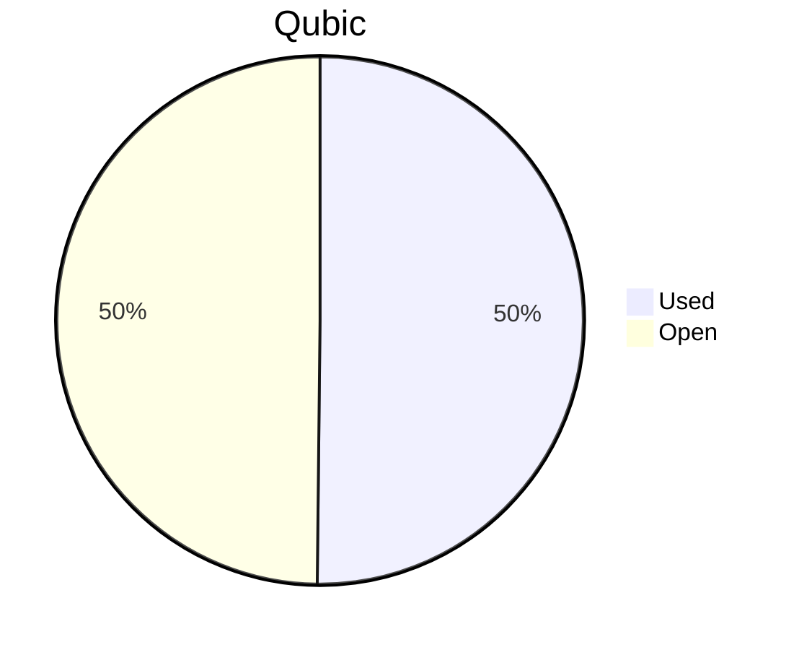

# Financial Reporting April 2026
For April 2026 a total of `159'742'449'783 Qubic` have been paid out.

For the payments made on the 05.05.2026, `159'742'449'713 Qubic` have been valued at `590/bln`.<br>

70 Qubic were spent in the Send to Many Transfers execution fees.<br>

> Total expenses for April were: **94'248.05 $** (paid until 05.05.2026)

## Cost Breakdown

<div style="display: flex; justify-content: center; align-items: center; gap: 10px;flex-wrap:wrap;">
<div>

 ```mermaid
pie title Categories
"Salaries":91.7726697962963
"Infrastructure":8.22733020370371
```

</div>
 <div>

 ```mermaid
pie title Categories
"Core":44.2734215707204
"Integration":17.1642657871732
"Testing":5.46430430663947
"Operation":0
"Overhead":21.1570732631733
"Infrastructure":8.22733020370371
"Client":3.71360486858993
```

 </div>
</div>

## Budget View
> Total available budget for March 2026 - June 2026: `572'000'000'000 Qubic`.

<div style="display: flex; justify-content: center; align-items: center; gap: 10px;flex-wrap:wrap;">
<div>



 </div>
</div>

## Included Salaries
Because not all team members receive a fixed salary and they send reports on their worked hours, the monthly budget for salaries fluctuate.<br>
The above numbers include the salaries for April 2026 of the following persons (alphabetical order):

```
alez
cyber-pc
dkat
feiyu.IV
fnordspace
kavatak
keta
kimz300
linckode
luk
mio
Mr.Rose
phil
raika sternensucher
sally
yurabb8
```

## Transactions


|    # | Date       | Target Month | Wallet             | Category               | $-Qubic/b |   Amount $ |   Amount Qubic | TX Link                                                                                            |
| ---: | :--------- | :----------- | :----------------- | :--------------------- | --------: | ---------: | -------------: | :------------------------------------------------------------------------------------------------- |
|    1 | 05.05.2026 | April        | QCT-Core           | Salary                 |       590 |  $4'000.00 |  6'779'661'017 | https://explorer.qubic.org/network/tx/lfrxrspxldwgzggqvpwmzefbkdlfvsxdxdjwmdwfudoioyfuejvvxuhgzjgm |
|    2 | 05.05.2026 | April        | QCT-Core           | Salary                 |       590 | $13'592.48 | 23'038'108'203 | https://explorer.qubic.org/network/tx/lfrxrspxldwgzggqvpwmzefbkdlfvsxdxdjwmdwfudoioyfuejvvxuhgzjgm |
|    3 | 05.05.2026 | April        | QCT-Core           | Salary                 |       590 |  $5'000.00 |  8'474'576'271 | https://explorer.qubic.org/network/tx/lfrxrspxldwgzggqvpwmzefbkdlfvsxdxdjwmdwfudoioyfuejvvxuhgzjgm |
|    4 | 05.05.2026 | April        | QCT-Core           | Salary                 |       590 | $11'570.35 | 19'610'763'715 | https://explorer.qubic.org/network/tx/lfrxrspxldwgzggqvpwmzefbkdlfvsxdxdjwmdwfudoioyfuejvvxuhgzjgm |
|    5 | 05.05.2026 | April        | QCT-Core           | Salary                 |       590 |  $5'499.00 |  9'320'338'983 | https://explorer.qubic.org/network/tx/lfrxrspxldwgzggqvpwmzefbkdlfvsxdxdjwmdwfudoioyfuejvvxuhgzjgm |
|    6 | 05.05.2026 | April        | QCT-Core           | Salary                 |       590 |  $2'065.00 |  3'500'000'000* | https://explorer.qubic.org/network/tx/lfrxrspxldwgzggqvpwmzefbkdlfvsxdxdjwmdwfudoioyfuejvvxuhgzjgm |
|    7 | 05.05.2026 | April        | QCT-Overhead       | Salary                 |       590 |  $6'000.00 | 10'169'491'525 | https://explorer.qubic.org/network/tx/oplphpgqcyrncbltlqsgmifszdycwunjpifjdccqfdqeudvbjxdonxudzkam |
|    8 | 05.05.2026 | April        | QCT-Overhead       | Salary                 |       590 |  $2'500.00 |  4'237'288'136 | https://explorer.qubic.org/network/tx/oplphpgqcyrncbltlqsgmifszdycwunjpifjdccqfdqeudvbjxdonxudzkam |
|    9 | 05.05.2026 | April        | QCT-Overhead       | Salary                 |       590 | $11'440.13 | 19'390'047'458 | https://explorer.qubic.org/network/tx/oplphpgqcyrncbltlqsgmifszdycwunjpifjdccqfdqeudvbjxdonxudzkam |
|   10 | 05.05.2026 | April        | QCT-Client         | Salary                 |       590 |  $1'500.00 |  2'542'372'881 | https://explorer.qubic.org/network/tx/zufwzzcxjxlcbedwelkpytmulewbckvwawqrfwyylbrjlqpvibwfgqbcmfla |
|   11 | 05.05.2026 | April        | QCT-Client         | Salary                 |       590 |  $2'000.00 |  3'389'830'508 | https://explorer.qubic.org/network/tx/zufwzzcxjxlcbedwelkpytmulewbckvwawqrfwyylbrjlqpvibwfgqbcmfla |
|   12 | 05.05.2026 | April        | QCT-Infrastructure | Server                 |       590 |    $753.56 |  1'277'223'559 | https://explorer.qubic.org/network/tx/qafsbocnebwszcyzkjqxzxnbusfcwlogexdoxshowbxbwueisfyhmfwfwtfd |
|   13 | 05.05.2026 | April        | QCT-Infrastructure | Server                 |       590 |  $1'216.80 |  2'062'372'881 | https://explorer.qubic.org/network/tx/qafsbocnebwszcyzkjqxzxnbusfcwlogexdoxshowbxbwueisfyhmfwfwtfd |
|   14 | 05.05.2026 | April        | QCT-Infrastructure | Services               |       590 |    $265.00 |    449'149'831 | https://explorer.qubic.org/network/tx/qafsbocnebwszcyzkjqxzxnbusfcwlogexdoxshowbxbwueisfyhmfwfwtfd |
|   15 | 05.05.2026 | April        | QCT-Infrastructure | Services               |       590 |  $1'100.00 |  1'864'406'780 | https://explorer.qubic.org/network/tx/qafsbocnebwszcyzkjqxzxnbusfcwlogexdoxshowbxbwueisfyhmfwfwtfd |
|   16 | 05.05.2026 | April        | QCT-Infrastructure | Services               |       590 |  $2'000.00 |  3'389'830'508 | https://explorer.qubic.org/network/tx/qafsbocnebwszcyzkjqxzxnbusfcwlogexdoxshowbxbwueisfyhmfwfwtfd |
|   17 | 05.05.2026 | April        | QCT-Integration    | Salary                 |       590 |  $4'760.00 |  8'067'796'610 | https://explorer.qubic.org/network/tx/zpsgbyjhxlydtbgxxcipuwlvdmdfhgtedomtebxoddllnudidhtdcyrbsngj |
|   18 | 05.05.2026 | April        | QCT-Integration    | Salary                 |       590 |    $125.38 |    212'500'000* | https://explorer.qubic.org/network/tx/zpsgbyjhxlydtbgxxcipuwlvdmdfhgtedomtebxoddllnudidhtdcyrbsngj |
|   19 | 05.05.2026 | April        | QCT-Integration    | Salary                 |       590 |  $1'491.61 |  2'528'152'542 | https://explorer.qubic.org/network/tx/zpsgbyjhxlydtbgxxcipuwlvdmdfhgtedomtebxoddllnudidhtdcyrbsngj |
|   20 | 05.05.2026 | April        | QCT-Integration    | Salary                 |       590 |  $9'800.00 | 16'610'169'492 | https://explorer.qubic.org/network/tx/zpsgbyjhxlydtbgxxcipuwlvdmdfhgtedomtebxoddllnudidhtdcyrbsngj |
|   21 | 05.05.2026 | April        | QCT-Testing        | Salary                 |       590 |  $3'150.00 |  5'338'983'051 | https://explorer.qubic.org/network/tx/aihjwqhayestvaqdeaqcsvtpbpngxkjbqjkuznpcihzrdabgljicuiucjdte |
|   22 | 05.05.2026 | April        | QCT-Testing        | Salary                 |       590 |  $2'000.00 |  3'389'830'508 | https://explorer.qubic.org/network/tx/aihjwqhayestvaqdeaqcsvtpbpngxkjbqjkuznpcihzrdabgljicuiucjdte |
|   23 | 05.05.2026 | April        | QCT-Infrastructure | Services               |       590 |  $1'280.00 |  2'169'491'525 | https://explorer.qubic.org/network/tx/qafsbocnebwszcyzkjqxzxnbusfcwlogexdoxshowbxbwueisfyhmfwfwtfd |
|   24 | 05.05.2026 | April        | QCT-Infrastructure | Server                 |       590 |    $577.21 |    978'318'305 | https://explorer.qubic.org/network/tx/qafsbocnebwszcyzkjqxzxnbusfcwlogexdoxshowbxbwueisfyhmfwfwtfd |
|   25 | 05.05.2026 | April        | QCT-Infrastructure | Server                 |       590 |    $561.53 |    951'745'424 | https://explorer.qubic.org/network/tx/qafsbocnebwszcyzkjqxzxnbusfcwlogexdoxshowbxbwueisfyhmfwfwtfd |

*Transactions #6 and #18: Fixed Qubic amounts agreed in advance; USD values are indicative only.

### Other Transfers

In addition to the regular monthly payments, a one-off transfer was made from the QCT treasury on 17.04.2026 to a dedicated wallet to compensate MEXC for losses caused by an integration-layer incident. This is **not** part of the operational cost breakdown above.

| Date       | From         | To                                                                 | Amount Qubic   | TX Link                                                                                            | Reference                          |
| :--------- | :----------- | :----------------------------------------------------------------- | -------------: | :------------------------------------------------------------------------------------------------- | :--------------------------------- |
| 17.04.2026 | QCT-Treasury | JXSQGHDICVEBEAGVGFTSSNUORXLCEBBROYMXHTPYDEIPBMXQRFPFYNPFMVUN       | 13'391'819'438 | https://explorer.qubic.org/network/tx/tkjfwrbmupgjncjoukqdjevknctfsdlfnoaylvozhdjmwstokggwuuehvblj | [QVE-2026-0001](../qve/QVE-2026-0001.md) |

See [QVE-2026-0001](../qve/QVE-2026-0001.md) for full incident details, root cause, mitigation, and funding sources.

### Current Balance

> Balance after payments (including 17.04 reimbursement): `285'045'896'271 Qubic`<br>
