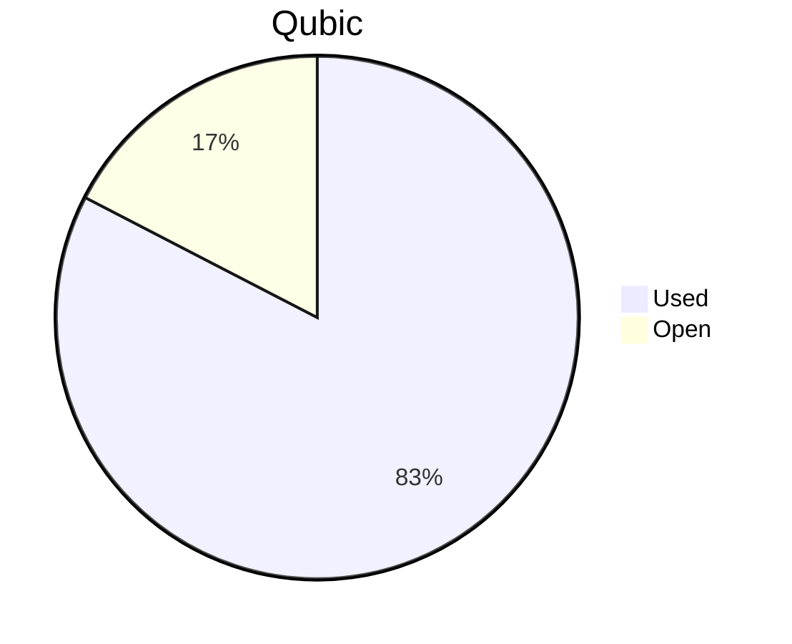

# Financial Reporting May 2026
For May 2026 a total of `185'484'580'100 Qubic` have been paid out.

For the payments made on the 05.06.2026, `185'484'580'030 Qubic` have been valued at `470/bln`.<br>

70 Qubic were spent in the Send to Many Transfers execution fees.<br>

> Total expenses for May were: **87'177.75 $** (paid until 05.06.2026)

## Cost Breakdown

<div style="display: flex; justify-content: center; align-items: center; gap: 10px;flex-wrap:wrap;">
<div>

 ```mermaid
pie title Categories
"Salaries":92.3764689949891
"Infrastructure":7.62353100501091
```

</div>
 <div>

 ```mermaid
pie title Categories
"Core":42.1522937471305
"Integration":17.634007288611
"Testing":5.90747047908293
"Operation":0
"Overhead":22.6679117176812
"Infrastructure":7.62353100501091
"Client":4.01478576248355
```

 </div>
</div>

## Budget View
> Total available budget for March 2026 - June 2026: `572'000'000'000 Qubic`.

<div style="display: flex; justify-content: center; align-items: center; gap: 10px;flex-wrap:wrap;">
<div>



 </div>
</div>

## Included Salaries
Because not all team members receive a fixed salary and they send reports on their worked hours, the monthly budget for salaries fluctuate.<br>
The above numbers include the salaries for May 2026 of the following persons (alphabetical order):

```
alez
cyber-pc
dkat
feiyu.IV
fnordspace
kavatak
keta
kimz300
linckode
luk
mio
Mr.Rose
phil
raika sternensucher
sally
yurabb8
```

## Transactions


|    # | Date       | Target Month | Wallet             | Category               | $-Qubic/b |   Amount $ |   Amount Qubic | TX Link                                                                                            |
| ---: | :--------- | :----------- | :----------------- | :--------------------- | --------: | ---------: | -------------: | :------------------------------------------------------------------------------------------------- |
|    1 | 05.06.2026 | May          | QCT-Core           | Salary                 |       470 |  $4'000.00 |  8'510'638'298 | https://explorer.qubic.org/network/tx/bfafasdzfjgkwetdydndeauizudfippqlyublvksbhuczaeukvjclieefoye |
|    2 | 05.06.2026 | May          | QCT-Core           | Salary                 |       470 | $11'435.36 | 24'330'550'000 | https://explorer.qubic.org/network/tx/bfafasdzfjgkwetdydndeauizudfippqlyublvksbhuczaeukvjclieefoye |
|    3 | 05.06.2026 | May          | QCT-Core           | Salary                 |       470 |  $5'000.00 | 10'638'297'872 | https://explorer.qubic.org/network/tx/bfafasdzfjgkwetdydndeauizudfippqlyublvksbhuczaeukvjclieefoye |
|    4 | 05.06.2026 | May          | QCT-Core           | Salary                 |       470 | $11'389.56 | 24'233'114'604 | https://explorer.qubic.org/network/tx/bfafasdzfjgkwetdydndeauizudfippqlyublvksbhuczaeukvjclieefoye |
|    5 | 05.06.2026 | May          | QCT-Core           | Salary                 |       470 |  $3'277.50 |  6'973'404'255 | https://explorer.qubic.org/network/tx/bfafasdzfjgkwetdydndeauizudfippqlyublvksbhuczaeukvjclieefoye |
|    6 | 05.06.2026 | May          | QCT-Core           | Salary                 |       470 |  $1'645.00 |  3'500'000'000* | https://explorer.qubic.org/network/tx/bfafasdzfjgkwetdydndeauizudfippqlyublvksbhuczaeukvjclieefoye |
|    7 | 05.06.2026 | May          | QCT-Overhead       | Salary                 |       470 |  $6'000.00 | 12'765'957'447 | https://explorer.qubic.org/network/tx/emnxdsjtpwgovapexzbrnlroejyflvrxsydqqtucdbfgwwkwqbcmjttctbam |
|    8 | 05.06.2026 | May          | QCT-Overhead       | Salary                 |       470 |  $2'500.00 |  5'319'148'936 | https://explorer.qubic.org/network/tx/emnxdsjtpwgovapexzbrnlroejyflvrxsydqqtucdbfgwwkwqbcmjttctbam |
|    9 | 05.06.2026 | May          | QCT-Overhead       | Salary                 |       470 | $11'261.38 | 23'960'374'468 | https://explorer.qubic.org/network/tx/emnxdsjtpwgovapexzbrnlroejyflvrxsydqqtucdbfgwwkwqbcmjttctbam |
|   10 | 05.06.2026 | May          | QCT-Client         | Salary                 |       470 |  $1'500.00 |  3'191'489'362 | https://explorer.qubic.org/network/tx/gfamlovsklymngzljsfpdrmjzzbexywmzcmksrljkempssywkvcazxkbdoci |
|   11 | 05.06.2026 | May          | QCT-Client         | Salary                 |       470 |  $2'000.00 |  4'255'319'149 | https://explorer.qubic.org/network/tx/gfamlovsklymngzljsfpdrmjzzbexywmzcmksrljkempssywkvcazxkbdoci |
|   12 | 05.06.2026 | May          | QCT-Infrastructure | Server                 |       470 |  $1'039.77 |  2'212'281'915 | https://explorer.qubic.org/network/tx/xsrjgvnjueaftezknyukjvkrarrbyfdwnebmljkemaakohyevzvlpkhghzef |
|   13 | 05.06.2026 | May          | QCT-Infrastructure | Server                 |       470 |  $1'007.94 |  2'144'554'255 | https://explorer.qubic.org/network/tx/xsrjgvnjueaftezknyukjvkrarrbyfdwnebmljkemaakohyevzvlpkhghzef |
|   14 | 05.06.2026 | May          | QCT-Infrastructure | Services               |       470 |    $263.15 |    559'895'745 | https://explorer.qubic.org/network/tx/xsrjgvnjueaftezknyukjvkrarrbyfdwnebmljkemaakohyevzvlpkhghzef |
|   15 | 05.06.2026 | May          | QCT-Infrastructure | Services               |       470 |  $1'100.00 |  2'340'425'532 | https://explorer.qubic.org/network/tx/xsrjgvnjueaftezknyukjvkrarrbyfdwnebmljkemaakohyevzvlpkhghzef |
|   16 | 05.06.2026 | May          | QCT-Infrastructure | Services               |       470 |  $2'000.00 |  4'255'319'149 | https://explorer.qubic.org/network/tx/xsrjgvnjueaftezknyukjvkrarrbyfdwnebmljkemaakohyevzvlpkhghzef |
|   17 | 05.06.2026 | May          | QCT-Integration    | Salary                 |       470 |  $3'850.00 |  8'191'489'362 | https://explorer.qubic.org/network/tx/xxcgqxjxxzkgrcnrfxdjviosbuahkcbzwfbwzehcbaeskmqmphffctefvzvb |
|   18 | 05.06.2026 | May          | QCT-Integration    | Salary                 |       470 |     $80.78 |    171'875'000* | https://explorer.qubic.org/network/tx/xxcgqxjxxzkgrcnrfxdjviosbuahkcbzwfbwzehcbaeskmqmphffctefvzvb |
|   19 | 05.06.2026 | May          | QCT-Integration    | Salary                 |       470 |  $1'742.15 |  3'706'702'128 | https://explorer.qubic.org/network/tx/xxcgqxjxxzkgrcnrfxdjviosbuahkcbzwfbwzehcbaeskmqmphffctefvzvb |
|   20 | 05.06.2026 | May          | QCT-Integration    | Salary                 |       470 |  $9'700.00 | 20'638'297'872 | https://explorer.qubic.org/network/tx/xxcgqxjxxzkgrcnrfxdjviosbuahkcbzwfbwzehcbaeskmqmphffctefvzvb |
|   21 | 05.06.2026 | May          | QCT-Testing        | Salary                 |       470 |  $3'150.00 |  6'702'127'660 | https://explorer.qubic.org/network/tx/rpkwqudyhcwougyomnxrnechhhabvaysecbzthzozbtwdkxxctxzvlkesgph |
|   22 | 05.06.2026 | May          | QCT-Testing        | Salary                 |       470 |  $2'000.00 |  4'255'319'149 | https://explorer.qubic.org/network/tx/rpkwqudyhcwougyomnxrnechhhabvaysecbzthzozbtwdkxxctxzvlkesgph |
|   23 | 05.06.2026 | May          | QCT-Infrastructure | Server                 |       470 |    $624.98 |  1'329'742'553 | https://explorer.qubic.org/network/tx/xsrjgvnjueaftezknyukjvkrarrbyfdwnebmljkemaakohyevzvlpkhghzef |
|   24 | 05.06.2026 | May          | QCT-Infrastructure | Services               |       470 |    $560.18 |  1'191'872'340 | https://explorer.qubic.org/network/tx/xsrjgvnjueaftezknyukjvkrarrbyfdwnebmljkemaakohyevzvlpkhghzef |
|   25 | 05.06.2026 | May          | QCT-Infrastructure | Services               |       470 |     $50.00 |    106'382'979 | https://explorer.qubic.org/network/tx/xsrjgvnjueaftezknyukjvkrarrbyfdwnebmljkemaakohyevzvlpkhghzef |

*Transactions #6 and #18: Fixed Qubic amounts agreed in advance; USD values are indicative only.

### Current Balance

> Balance after payments: `99'561'316'171 Qubic`<br>

> The remaining treasury balance of `99'561'316'171 Qubic` (~$46'794 at `470 USD/bln`) will not be sufficient to cover the June 2026 expenses. The current budget of `572'000'000'000 Qubic` was approved for the period March 2026 – June 2026 (4 months) at a valuation of `700 USD/bln`. Due to the lower valuation of Qubic, a new funding proposal will be submitted to cover June 2026 expenses and operations beyond.
