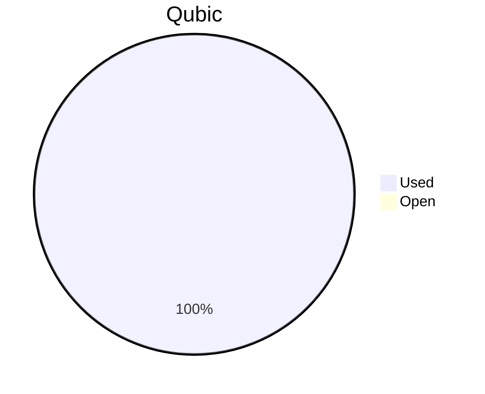

# Financial Reporting June 2026
For June 2026 the total expenses were **`75'855.12 $`** (`184'114'377'029 Qubic`, valued at `412/bln`).

The QCT treasury did not hold enough Qubic to cover the full month, so the expenses were settled in two parts:

> - `98'880'685'282 Qubic` (~$40'738.84) paid on-chain from the QCT treasury on 06.07.2026.
> - `85'233'691'747 Qubic` (~$35'116.28) covered by J0ET0M from personal funds, to be reimbursed via the next QCT budget proposal.

## Cost Breakdown

<div style="display: flex; justify-content: center; align-items: center; gap: 10px;flex-wrap:wrap;">
<div>

 ```mermaid
pie title Categories
"Salaries":91.2931225874554
"Infrastructure":8.70687741254456
```

</div>
 <div>

 ```mermaid
pie title Categories
"Core":43.4864466436704
"Integration":14.2400994487258
"Testing":6.78925796111107
"Operation":0
"Overhead":22.1632597254261
"Client":4.61405880852208
"Infrastructure":8.70687741254456
```

 </div>
</div>

## Budget View
> Total available budget for March 2026 - June 2026: `572'000'000'000 Qubic`. After June's payments only `680'630'889 Qubic` remain — not enough to cover further expenses — so the budget is effectively exhausted.

<div style="display: flex; justify-content: center; align-items: center; gap: 10px;flex-wrap:wrap;">
<div>



 </div>
</div>

## Included Salaries
Because not all team members receive a fixed salary and they send reports on their worked hours, the monthly budget for salaries fluctuate.<br>
The above numbers include the salaries for June 2026 of the following persons (alphabetical order):

```
alez
cyber-pc
dkat
feiyu.IV
fnordspace
kavatak
keta
kimz300
linckode
luk
mio
Mr.Rose
raika sternensucher
sally
yurabb8
```

## Transactions


|    # | Date       | Target Month | Wallet             | Category | $-Qubic/b |   Amount $ |   Amount Qubic | TX Link                                                                                            |
| ---: | :--------- | :----------- | :----------------- | :------- | --------: | ---------: | -------------: | :------------------------------------------------------------------------------------------------- |
|    1 | 06.07.2026 | June         | QCT-Core           | Salary   |       412 |  $4'000.00 |  9'708'737'864 | https://explorer.qubic.org/network/tx/xrakudldovcafbyvkcpiybfztnmexmstndtdnkawzdnuqprnsyhmvnzgyoti |
|    2 | 06.07.2026 | June         | QCT-Core           | Salary   |       412 |  $5'000.00 | 12'135'922'330 | https://explorer.qubic.org/network/tx/xrakudldovcafbyvkcpiybfztnmexmstndtdnkawzdnuqprnsyhmvnzgyoti |
|    3 | 06.07.2026 | June         | QCT-Core           | Salary   |       412 | $11'208.78 | 27'205'769'748 | https://explorer.qubic.org/network/tx/xrakudldovcafbyvkcpiybfztnmexmstndtdnkawzdnuqprnsyhmvnzgyoti |
|    4 | 06.07.2026 | June         | QCT-Core           | Salary   |       412 |  $1'442.00 |  3'500'000'000* | https://explorer.qubic.org/network/tx/xrakudldovcafbyvkcpiybfztnmexmstndtdnkawzdnuqprnsyhmvnzgyoti |
|    5 | 06.07.2026 | June         | QCT-Overhead       | Salary   |       412 |  $6'000.00 | 14'563'106'796 | https://explorer.qubic.org/network/tx/omammvycqlxitburvmrewfadbhjbyenqnbkegzjqmfvxcwpbwmhoaulcjzko |
|    6 | 06.07.2026 | June         | QCT-Overhead       | Salary   |       412 |  $2'500.00 |  6'067'961'165 | https://explorer.qubic.org/network/tx/omammvycqlxitburvmrewfadbhjbyenqnbkegzjqmfvxcwpbwmhoaulcjzko |
|    7 | 06.07.2026 | June         | QCT-Client         | Salary   |       412 |  $1'500.00 |  3'640'776'699 | https://explorer.qubic.org/network/tx/csuzdcmhssirmfmyebpfmrhkrjzfqmzodaemwulsffvzykebnptjgkceosbh |
|    8 | 06.07.2026 | June         | QCT-Client         | Salary   |       412 |  $2'000.00 |  4'854'368'932 | https://explorer.qubic.org/network/tx/xfajlxdtxonsrahualnqtofkwoxgwstddkiomfutvclqsdwndbkvyrvevxbj |
|    9 | 06.07.2026 | June         | QCT-Infrastructure | Server   |       412 |  $1'111.91 |  2'698'811'650 | https://explorer.qubic.org/network/tx/whlhmmrcrmmlocuojvmmpkvehzqgxfspiwkadildnbyjxstdkxovttydazrg |
|   10 | 06.07.2026 | June         | QCT-Infrastructure | Server   |       412 |    $999.18 |  2'425'183'981 | https://explorer.qubic.org/network/tx/whlhmmrcrmmlocuojvmmpkvehzqgxfspiwkadildnbyjxstdkxovttydazrg |
|   11 | 06.07.2026 | June         | QCT-Infrastructure | Services |       412 |    $258.97 |    628'577'670 | https://explorer.qubic.org/network/tx/whlhmmrcrmmlocuojvmmpkvehzqgxfspiwkadildnbyjxstdkxovttydazrg |
|   12 | 06.07.2026 | June         | QCT-Infrastructure | Services |       412 |  $1'100.00 |  2'669'902'913 | https://explorer.qubic.org/network/tx/uxmmcxxoeyppndqzbcuzxfoypqkhacwcwbfrxudmydaaydjbfcgzosgdntgc |
|   13 | 06.07.2026 | June         | QCT-Infrastructure | Services |       412 |  $2'000.00 |  4'854'368'932 | https://explorer.qubic.org/network/tx/uxmmcxxoeyppndqzbcuzxfoypqkhacwcwbfrxudmydaaydjbfcgzosgdntgc |
|   14 | 06.07.2026 | June         | QCT-Integration    | Salary   |       412 |    $126.18 |    306'250'000* | https://explorer.qubic.org/network/tx/ytxifarqkpijoaslamfkzhrxqiwfixtnpgfizhozzbnwvkfmlvhrabzcqzoh |
|   15 | 06.07.2026 | June         | QCT-Integration    | Salary   |       412 |    $940.00 |  2'281'553'398 | https://explorer.qubic.org/network/tx/ytxifarqkpijoaslamfkzhrxqiwfixtnpgfizhozzbnwvkfmlvhrabzcqzoh |
|   16 | 06.07.2026 | June         | QCT-Infrastructure | Services |       412 |    $483.82 |  1'174'320'388 | https://explorer.qubic.org/network/tx/uxmmcxxoeyppndqzbcuzxfoypqkhacwcwbfrxudmydaaydjbfcgzosgdntgc |
|   17 | 06.07.2026 | June         | QCT-Infrastructure | Services |       412 |     $68.01 |    165'072'816 | https://explorer.qubic.org/network/tx/whlhmmrcrmmlocuojvmmpkvehzqgxfspiwkadildnbyjxstdkxovttydazrg |

*Transactions #4 and #14: Fixed Qubic amounts agreed in advance; USD values are indicative only.

### Current Balance

> Balance after payments: `680'630'889 Qubic`<br>
> This remaining balance is not enough to cover further expenses, so the March 2026 - June 2026 budget is effectively exhausted.<br>
> `85'233'691'747 Qubic` (`$35'116.28`) of June expenses were covered by J0ET0M from personal funds and remain to be reimbursed in the next QCT budget proposal.<br>
