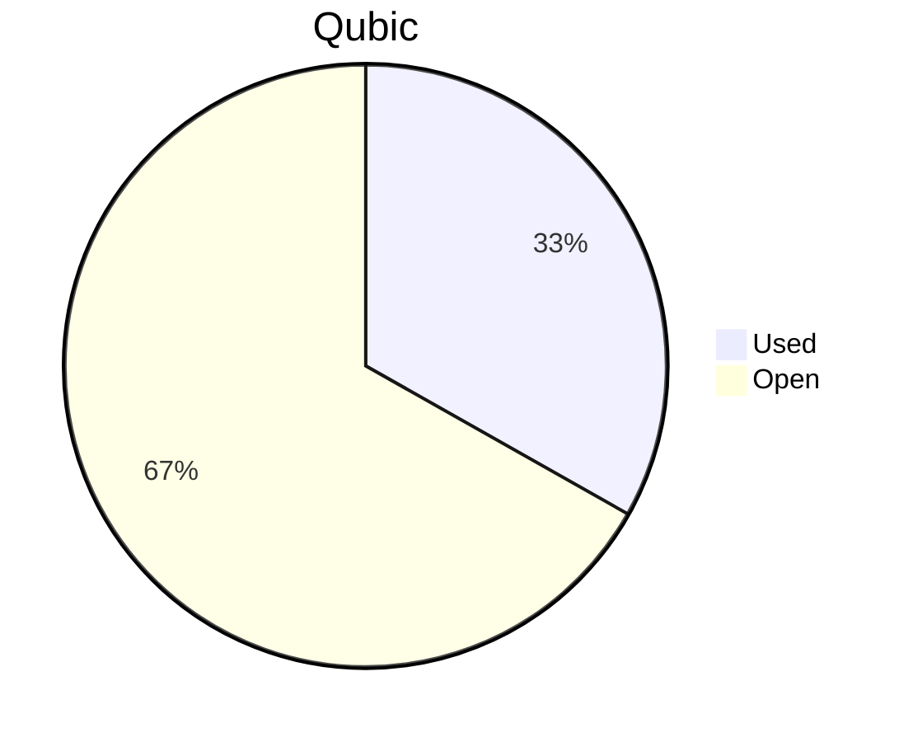

# Financial Reporting July 2026
For July 2026 a total of `137'430'852'751 Qubic` have been paid out.

For the payments made on the 05.08.2026, `137'430'852'691 Qubic` have been valued at `441/bln`.<br>

60 Qubic were spent in the Send to Many Transfers execution fees.<br>

> Total expenses for July were: **60'607.01 $** (paid until 05.08.2026)

## Cost Breakdown

<div style="display: flex; justify-content: center; align-items: center; gap: 10px;flex-wrap:wrap;">
<div>

 ```mermaid
pie title Categories
"Salaries":92.7644173721514
"Infrastructure":7.23558262784865
```

</div>
 <div>

 ```mermaid
pie title Categories
"Core":54.9228145607915
"Integration":4.71566356256298
"Testing":8.4973674445178
"Operation":0
"Overhead":22.1536104126719
"Client":2.47496139160713
"Infrastructure":7.23558262784865
```

 </div>
</div>

## Budget View
> Total available budget for July 2026 - September 2026: `671'000'000'000 Qubic` (received on 15.07.2026).<br>
> This Q3 budget also covers the June 2026 reimbursement to J0ET0M (see below).<br>
> Used in July: `222'664'544'498 Qubic` (operational + June reimbursement) = 33.18%.

<div style="display: flex; justify-content: center; align-items: center; gap: 10px;flex-wrap:wrap;">
<div>



 </div>
</div>

## Included Salaries
Because not all team members receive a fixed salary and they send reports on their worked hours, the monthly budget for salaries fluctuate.<br>
The above numbers include the salaries for July 2026 of the following persons (alphabetical order):

```
cyber-pc
dkat
feiyu.IV
fnordspace
kavatak
keta
kimz300
linckode
luk
Mr.Rose
raika sternensucher
sally
yurabb8
```

## Transactions


|    # | Date       | Target Month | Wallet             | Category | $-Qubic/b |   Amount $ |   Amount Qubic | TX Link                                                                                            |
| ---: | :--------- | :----------- | :----------------- | :------- | --------: | ---------: | -------------: | :------------------------------------------------------------------------------------------------- |
|    1 | 05.08.2026 | July | QCT-Core           | Salary   | 441 |    $4'000.00 |   9'070'294'785 | https://explorer.qubic.org/network/tx/wxwvvkpuwsglsaivsdnbbxwqqdvbjxtoctzazqfepgretrqhawwwibtakgej |
|    2 | 05.08.2026 | July | QCT-Core           | Salary   | 441 |   $11'534.80 |  26'156'000'907 | https://explorer.qubic.org/network/tx/wxwvvkpuwsglsaivsdnbbxwqqdvbjxtoctzazqfepgretrqhawwwibtakgej |
|    3 | 05.08.2026 | July | QCT-Core           | Salary   | 441 |    $5'000.00 |  11'337'868'481 | https://explorer.qubic.org/network/tx/wxwvvkpuwsglsaivsdnbbxwqqdvbjxtoctzazqfepgretrqhawwwibtakgej |
|    4 | 05.08.2026 | July | QCT-Core           | Salary   | 441 |   $11'208.78 |  25'416'728'200 | https://explorer.qubic.org/network/tx/wxwvvkpuwsglsaivsdnbbxwqqdvbjxtoctzazqfepgretrqhawwwibtakgej |
|    5 | 05.08.2026 | July | QCT-Core           | Salary   | 441 |    $1'543.50 |  3'500'000'000* | https://explorer.qubic.org/network/tx/wxwvvkpuwsglsaivsdnbbxwqqdvbjxtoctzazqfepgretrqhawwwibtakgej |
|    6 | 05.08.2026 | July | QCT-Integration    | Salary   | 441 |    $1'400.00 |   3'174'603'175 | https://explorer.qubic.org/network/tx/wxwvvkpuwsglsaivsdnbbxwqqdvbjxtoctzazqfepgretrqhawwwibtakgej |
|    7 | 05.08.2026 | July | QCT-Integration    | Salary   | 441 |       $27.56 |     62'500'000* | https://explorer.qubic.org/network/tx/wxwvvkpuwsglsaivsdnbbxwqqdvbjxtoctzazqfepgretrqhawwwibtakgej |
|    8 | 05.08.2026 | July | QCT-Integration    | Salary   | 441 |    $1'430.46 |   3'243'673'469 | https://explorer.qubic.org/network/tx/wxwvvkpuwsglsaivsdnbbxwqqdvbjxtoctzazqfepgretrqhawwwibtakgej |
|    9 | 05.08.2026 | July | QCT-Client         | Salary   | 441 |    $1'500.00 |   3'401'360'544 | https://explorer.qubic.org/network/tx/wxwvvkpuwsglsaivsdnbbxwqqdvbjxtoctzazqfepgretrqhawwwibtakgej |
|   10 | 05.08.2026 | July | QCT-Overhead       | Salary   | 441 |    $4'000.00 |   9'070'294'785 | https://explorer.qubic.org/network/tx/wxwvvkpuwsglsaivsdnbbxwqqdvbjxtoctzazqfepgretrqhawwwibtakgej |
|   11 | 05.08.2026 | July | QCT-Overhead       | Salary   | 441 |    $2'500.00 |   5'668'934'240 | https://explorer.qubic.org/network/tx/wxwvvkpuwsglsaivsdnbbxwqqdvbjxtoctzazqfepgretrqhawwwibtakgej |
|   12 | 05.08.2026 | July | QCT-Overhead       | Salary   | 441 |    $6'926.64 |  15'706'666'667 | https://explorer.qubic.org/network/tx/wxwvvkpuwsglsaivsdnbbxwqqdvbjxtoctzazqfepgretrqhawwwibtakgej |
|   13 | 05.08.2026 | July | QCT-Testing        | Salary   | 441 |    $3'150.00 |   7'142'857'143 | https://explorer.qubic.org/network/tx/wxwvvkpuwsglsaivsdnbbxwqqdvbjxtoctzazqfepgretrqhawwwibtakgej |
|   14 | 05.08.2026 | July | QCT-Testing        | Salary   | 441 |    $2'000.00 |   4'535'147'392 | https://explorer.qubic.org/network/tx/wxwvvkpuwsglsaivsdnbbxwqqdvbjxtoctzazqfepgretrqhawwwibtakgej |
|   15 | 05.08.2026 | July | QCT-Infrastructure | Server   | 441 |    $1'208.22 |   2'739'730'612 | https://explorer.qubic.org/network/tx/wxwvvkpuwsglsaivsdnbbxwqqdvbjxtoctzazqfepgretrqhawwwibtakgej |
|   16 | 05.08.2026 | July | QCT-Infrastructure | Server   | 441 |    $1'016.71 |   2'305'453'968 | https://explorer.qubic.org/network/tx/wxwvvkpuwsglsaivsdnbbxwqqdvbjxtoctzazqfepgretrqhawwwibtakgej |
|   17 | 05.08.2026 | July | QCT-Infrastructure | Services | 441 |      $223.50 |     506'797'279 | https://explorer.qubic.org/network/tx/wxwvvkpuwsglsaivsdnbbxwqqdvbjxtoctzazqfepgretrqhawwwibtakgej |
|   18 | 05.08.2026 | July | QCT-Infrastructure | Services | 441 |    $1'100.00 |   2'494'331'066 | https://explorer.qubic.org/network/tx/wxwvvkpuwsglsaivsdnbbxwqqdvbjxtoctzazqfepgretrqhawwwibtakgej |
|   19 | 05.08.2026 | July | QCT-Infrastructure | Server   | 441 |      $481.86 |   1'092'662'132 | https://explorer.qubic.org/network/tx/wxwvvkpuwsglsaivsdnbbxwqqdvbjxtoctzazqfepgretrqhawwwibtakgej |
|   20 | 05.08.2026 | July | QCT-Infrastructure | Services | 441 |      $291.82 |     661'723'356 | https://explorer.qubic.org/network/tx/wxwvvkpuwsglsaivsdnbbxwqqdvbjxtoctzazqfepgretrqhawwwibtakgej |
|   21 | 05.08.2026 | July | QCT-Infrastructure | Services | 441 |       $63.16 |     143'224'490 | https://explorer.qubic.org/network/tx/wxwvvkpuwsglsaivsdnbbxwqqdvbjxtoctzazqfepgretrqhawwwibtakgej |

*Transactions #5 and #7: Fixed Qubic amounts agreed in advance; USD values are indicative only.

### Reimbursement — June 2026 shortfall

In June 2026, J0ET0M covered `$35'116.28` of expenses from personal funds because the treasury was insufficient (see the [June 2026 report](2026-07-06-june-2026.md)). This has now been reimbursed with the fixed Qubic amount from June. This transfer is **not** part of July's operational cost breakdown above and is covered by the Q3 2026 budget.

| Date       | To                                                           | Amount Qubic   | Reference           | TX Link                                                                                            |
| :--------- | :----------------------------------------------------------- | -------------: | :------------------ | :------------------------------------------------------------------------------------------------- |
| 06.08.2026 | VCPNKFSHZUOMRCEDHDGJITGPRBEBGMLTBBQSDJWPSBQPNVLNGUUPWBQBVVOL | 85'233'691'747 | June 2026 shortfall | https://explorer.qubic.org/network/tx/gosyjaprsnhhkgdpdxtqictrdvnbwydvxthlwgyakcasaioqmbgrmzdganrm |

Note: J0ET0M directed the reimbursement to a wallet reserved for an upcoming community fund initiative that he currently administers, rather than receiving it personally. Further details will be shared once the initiative is public.

### Current Balance

> Balance after payments: `449'016'086'391 Qubic`<br>
