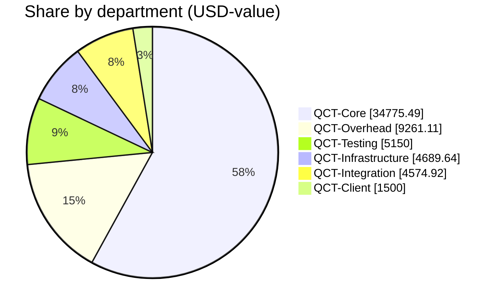
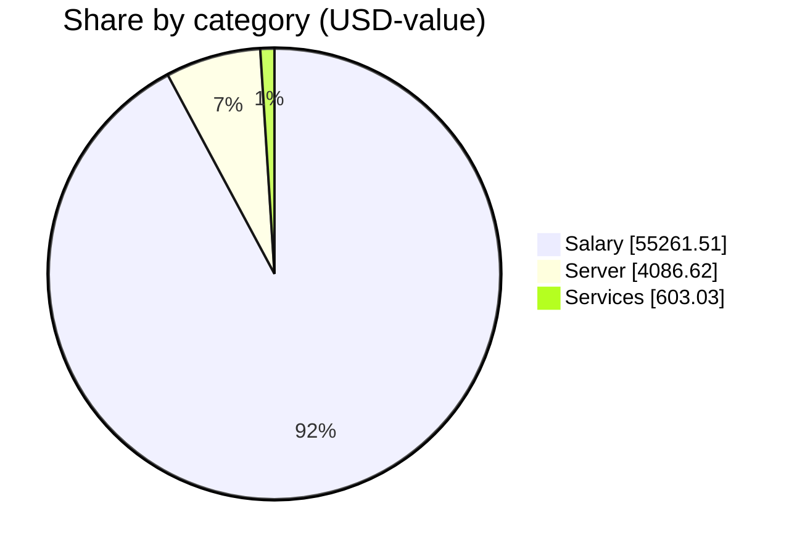

# QCT Financial Report — 2026-08

_Published by the **Qubic Core Team**. All figures are aggregated at the department level; individual amounts are private. Every treasury movement is verifiable on-chain via the transaction ids listed below._

**Status:** ✅ Finalized on 2026-09-06 22:48 UTC.

## Summary

| Metric | Value |
|---|---|
| Report month | 2026-08 |
| Payments processed | 21 |
| Departments funded | 6 |
| Total USD-value | 59,951.16 |
| Total QU sent | 141,491,814,311 |
| Total network fees | 70 QU |
| **Total QU debited from treasury** | **141,491,814,381** |

## Treasury state

Treasury address: `XQCLNHCEHTKQZDBAHJFVVTRMWFACMAZOBAEDQHEITGGEWZDIBRAIYWPGEONG`

| Metric | QU | ≈ USD (at run rates) |
|---|--:|--:|
| Balance snapshot | 305,503,930,390 | 129,444.34 |
| This run's outflow | −141,491,814,381 | −59,951.16 |

_Balance fetched 2026-09-06 23:11 UTC from `https://rpc.qubic.org`. Verify live at [rpc.qubic.org/v1/balances/XQCLNH…EONG](https://rpc.qubic.org/v1/balances/XQCLNHCEHTKQZDBAHJFVVTRMWFACMAZOBAEDQHEITGGEWZDIBRAIYWPGEONG)._

## Exchange rates applied

| Rate | Value | Notes |
|---|--:|---|
| QU per USD | 2,360,118 | 3-day average |
| USD per EUR | 1.1622 | ECB reference (Frankfurter) |
| USD per CHF | 1.2357 | ECB reference (Frankfurter) |
| USD per USDT | 1.0000 | pinned |
| USD per USDC | 1.0000 | pinned |

Rates are frozen on the run at creation and any 'Refresh rates' click.

## Spend by department

| Department | Payments | USD-value | QU (incl. fees) | Share of run |
|---|--:|--:|--:|--:|
| QCT-Core | 5 | 34,775.49 | 82,074,255,617 | 58.0% |
| QCT-Overhead | 3 | 9,261.11 | 21,857,312,121 | 15.4% |
| QCT-Testing | 2 | 5,150.00 | 12,154,608,608 | 8.6% |
| QCT-Infrastructure | 7 | 4,689.64 | 11,068,112,898 | 7.8% |
| QCT-Integration | 3 | 4,574.92 | 10,797,347,856 | 7.6% |
| QCT-Client | 1 | 1,500.00 | 3,540,177,271 | 2.5% |

## Spend by category

| Category | Payments | USD-value | QU | Share |
|---|--:|--:|--:|--:|
| Salary | 14 | 55,261.51 | 130,423,701,423 | 92.2% |
| Server | 4 | 4,086.62 | 9,644,902,532 | 6.8% |
| Services | 3 | 603.03 | 1,423,210,356 | 1.0% |

## Network fees

| Hop | sendMany calls | Fee (QU) |
|---|--:|--:|
| Treasury → Departments | 1 | 10 |
| Departments → recipients | 6 | 60 |
| **Total** | **7** | **70** |

## On-chain transactions

Every treasury movement in this run is verifiable on-chain.

### Treasury sendMany batches (internal Treasury → Departments)

| Batch | Tx |
|---|---|
| 1 | [`skphku…phwe`](https://explorer.qubic.org/network/tx/skphkughdssycbobahdobalyfgacpbloucdutruiafjcysxagemhloufphwe) |

### Department distributions (Departments → recipients)

Per-recipient identities and amounts are not disclosed; only the aggregate sendMany transaction ids per department are shown so anyone can reconcile the on-chain totals.

| Department | Recipients | sendMany calls | Tx ids |
|---|--:|--:|---|
| QCT-Client | 1 | 1 | [`jwjlpd…fuzd`](https://explorer.qubic.org/network/tx/jwjlpduaatilyeuycwpzxzcivkwcmbzwlprwzqcjihqgdwjrtumpsxdhfuzd) |
| QCT-Core | 5 | 1 | [`wkzwrl…glbb`](https://explorer.qubic.org/network/tx/wkzwrlxpmzsgveispdsvfkyvreifxfsuyqsmjllgxdkbygkhqslvcnbdglbb) |
| QCT-Infrastructure | 7 | 1 | [`inaquy…fafj`](https://explorer.qubic.org/network/tx/inaquysqffpdaagfpuzsqzsjaxaamlgzjsytajexaafzvbfijlqythvefafj) |
| QCT-Integration | 3 | 1 | [`udblpu…mvdm`](https://explorer.qubic.org/network/tx/udblpuerdlkwkbphtqokcgxttlbarlomwtrjulmbxcushzrmccaloyrdmvdm) |
| QCT-Overhead | 3 | 1 | [`mupzcw…hjbl`](https://explorer.qubic.org/network/tx/mupzcwwvyqrahbkajhdanjqoefzfjwinldsqnsbbbgfwvzytnhrwwyvchjbl) |
| QCT-Testing | 2 | 1 | [`mfzkkf…sipi`](https://explorer.qubic.org/network/tx/mfzkkfrxqewyicpeiucxcuynbfhgmqvvwhpbpinaahnaetatlrgyrihasipi) |

## Notes

- Payment amounts are quoted in USD-value using the frozen exchange rates above.
- Recipients who prefer stables (USDT/USDC) receive QU on-chain at their contractor's wallet; the contractor converts and forwards off-chain.
- Transaction references link to the Qubic explorer.

_Generated 2026-09-06 23:11 UTC by QCT.PayOps._
