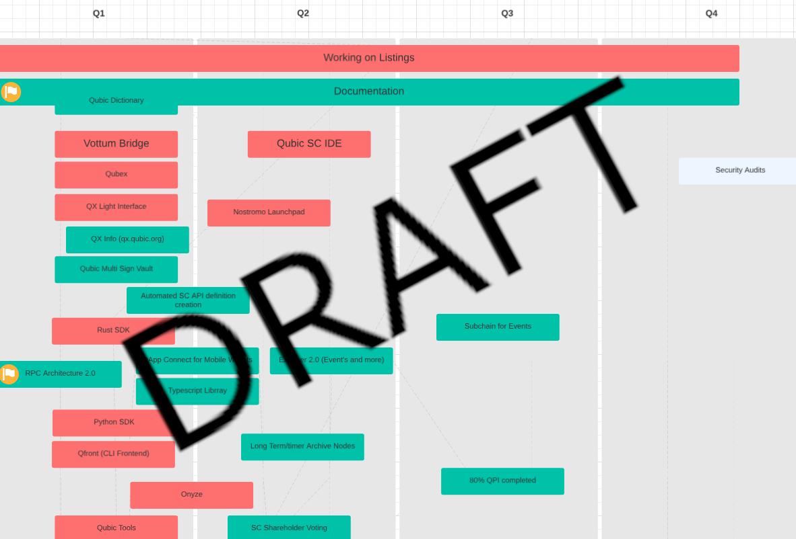

# Meeting about tech strategy 2025

> Monday, 7. January: 14:00 - 17:00 UTC
> 
> Follow up: Thursday, 23. January: 14:00 – 17:00 UTC

## People
- @Alber  (ecosystem lead)
- @wfschrec (ecosystem/core tech coordinator)
- @Berti (core tech planning lead)
- @sally (pm/po part for current client stuff)
- @foley (marketing; only on follow up)
- @joetom (QCT lead)

## Topic
Main topic of this meeting was aobut how/what to prioritize in 2025. Working on a roadmap and align Ecosystem and QCT workgroups. Inform also marketing about planned activities.

## Decision
- This meeting shall be held on a regular interval (@wfschrec will lead)
- This meeting shall be seen as "Product owner" for the core development
- High level priorities are used to plan/prioritize developments
- The current versions of Wallet (mobile/web), Explorer, Proposal shall still be maintained
- Quottery is not part of core development
- We want to see also community projects on the roadmap
- To document tech/dev knowledge we want to create a wiki/faq to which we can refer if we get common question (a need from developers)

## Discussion
We had a lot of discussion on current issues (e.g. MEXC deposit/withdrawal problems). We discussed about what platform shuold be used to exchange information and how to provide knowledge do ecosystem developers.

Current states of projects like Quottery, Wallet and others.

We also considered to do security audits. at the current state of the development it most probably is to early (still a lot of changes in core); the security audits should therefore be done when code is almost finished or there is a specific need for a listing or a partnership.

Roadmap discussion. We identified/discussed about topics we can put on the 2025 roadmap. There are many light house projects. We are very hard frontloaded and will do a rolling planning each for 1-3 months.

How should we track our projects and their progress? @wfschreck has set-up a test instance with open project. With that we could track our projects and also allow others to join. Together with @berts they will start with a tryout on using open project for qubic.

## Identified Priorities
Beside many other important things we have identified those priorities:
- Documentation (for all teams)
- RPC Architecture 2.0 (optimize RPC platform for a brougther use)
- Qubic clang port (Qubic core shall be compiled with clan)
- Wallet Connect (allow DApps to connect to qubic wallet; for those who read this: we expect a first beta to be released in the first week of february)
- Metamask Snap (allow qubic to be used in metamask)
- Docker Test Nodes (allow running a local qubic test net via docker)

## Roadmap Workpaper
One of the outputs of the meetings is the draft of a roadmap. the timings are not yet fixed. It is only a preview and not the complete list.

@wfschrec, @berti and @sally will finalize the draft roadmap and add milestones for each item.
