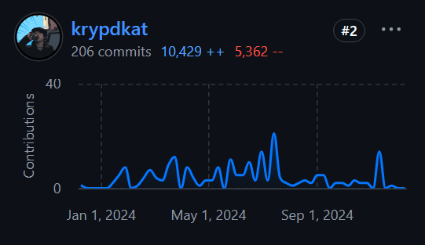

# Qubic Core Technology
> 2024-12-13

We are happy to say that we were able to strengthen the QCT team since the last update and nobody left the team.

## Recently joined the team

**December 2024**
- @YuraBB8 as Tester
- @berti as PM

**November 2024**
- @wfschrec as PM
- @mio as developer

## Recently left the team
none

## Celebrating 1 year of Qubic
Our software architect and core dev **@dkat** working tirelessly on improving Qubic!

every 1.7 day dkat contributed code to the qubic repositories over the last year!

## Current Members of QCT

### Core Developers
> The core development team is **complete**.

The core team builds and maintains the qubic core and CLI.
It gives support for ecosystem developers for smart contracts.

| Person   |      Position      |  Work load |
|----------|-------------|------:| --- | 
| @dkat |  Software Architect |   ~10-50% |
| @phil |    Lead Developer   |   ~50% |
| @cyber-pc | Developer |    ~100% |
| @fnordspace | Developer |    ~80% |
| @raika sternensucher | Developer |    ~80% |

### Integration Developers
> The integration team is yet **not** complete

The integration team builds and maintains the RPC/API and the Qubic GO/TS SDK's. It gives support for ecosystem developers for using RPC/API/Archive.

| Person   |      Position      |  Work load |
|----------|-------------|------:|
| @luk |  Software Architect / Head |   ~80% |
| @linckode |    Developer   |   ~100% |
| @mio | Developer |    ~50% |
| vacancy | Developer |    ~50-100% |
| vacancy | Developer |    ~50-100% |

### Testing Team
> The testing team is **complete**.

The testing team is operating the dedicated test networks for testing core updates. it provides also networks for ecosystem developers when they want to try their smart contracts in a production near environment.

| Person   |      Position      |  Work load |
|----------|-------------|------:|
| @kavatak |  Senior Tester / Head |   ~100% |
| @YuraBB8 |    Tester   |   ~100% (trial) |

### Operation Team
> The operation team is yet **not** complete.

The operation team will handle the monitoring of the qubic network and the RPC/API infrastructure. it is the first level support for computor operators.

| Person   |      Position      |  Work load |
|----------|-------------|------:|
| vacancy |  Operator |   ~50-100% |
| vacancy |    Operator   |   ~50-100% |

### PM + Overhead Team
> The pm team is complete.

| Person   |      Position      |  Work load |
|----------|-------------|------:|
| @berti |  PM (volunteer) |   ~10-20% (trial) |
| @wfschrec |    PM   |   ~50% (trial) |
| @icyblob |    POC developer   |   ~100% |
| @frog-rabbit |    PM (volunteer)   |   ~10-20% |
| @Come-from-Beyond |    advisor/developer (volunteer)   |   ~10-20% |
| @joetom |    administration/developer (volunteer)   |   ~10-20% |